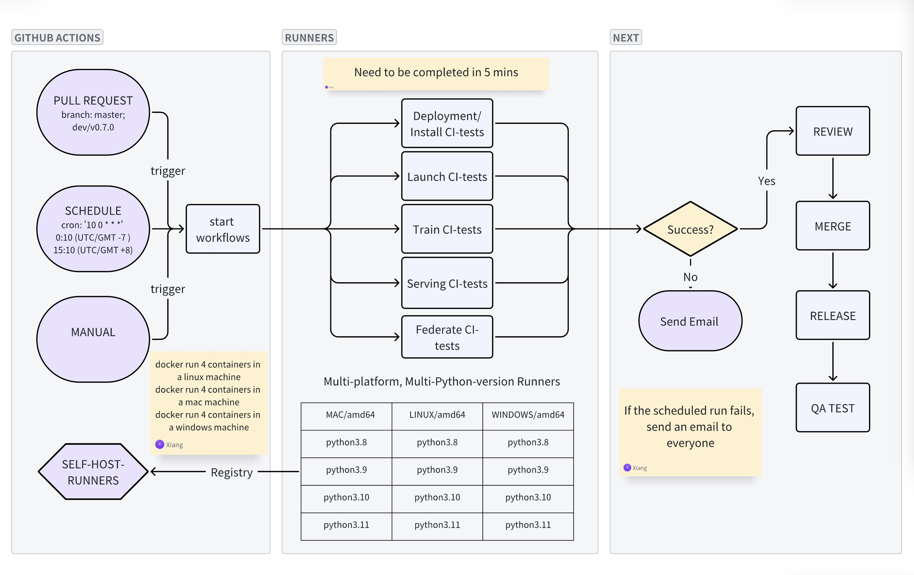

# 1. Design



##  Design principles

The CI tests need to be comprehensive, covering typical scenarios only, achievable within 5 minutes.

# 2. Registry Self-Host Runners

## 2.1 Linux Runners

We need to run CI tests in linux enviroment using different python versions such as python3.8/python3.9/python3.10/python3.11

Therefore firstly we build linux images for Self-Host Runners.

```
cd registry-runners
bash build_linux_runners.sh
```
Secondly we need to find your GitHub runner token and your test-account apikey.

For the argument YourGitHubRunnerToken, you may navigate based the following path.

Settings -> Actions -> Runners -> New self-hosted runner. 

In the Configure section, you should find the similar line:
./config.sh --url https://github.com/FedML-AI/FedML --token AXRYPL6G2VHVGDFDQQS5XA3ELYI6M

set YourGitHubRunnerToken to value of --token

Then we run all ther images.
```
bash run_linux_runners.sh [YourGitRepo] [YourGitHubRunnerToken] [YourTestAccountApiKey]
```
for example
```
bash run_linux_runners.sh FedML-AI/FedML AXRYPLZLZN6XVJB3BAIXSP3EMFC7U 11215dkevvdkegged
```
Lastly we need to check if the runners are registered successfully. Navigate the following path.
```
Settings -> Actions -> Runners
```
to check that your runners are all active. 

## 2.2 Windows Runners

step1: Install Anaconda packages
Install Anaconda or Miniconda in a windows machine. the Anaconda and Miniconda can manage your python environments.

step2: Create python enviroments
Create 4 python environments named python38、python39、python310、python311, you also need to specific `python==3.8` to install specific python version.
For example 
```
conda create -n python38 python==3.8
```
step3: Create directories 
Create 4 directories named actions-runner-python38、actions-runner-python39、actions-runner-python310、actions-runner-python311 used for different runners.

step4: Install the latest runner package. 
Follow the insturction from navigating this path `Settings -> Actions -> Runners -> New self-hosted runner` to add a new windows runner. Note that You just do the download、extract steps in the directories which we have created, we don't need to configure it and run it. We can run a script to registry all the runners. 

step5: Registry all the runners.
Run the script from ./registry-runners/windows.ps1 to registry all the runners to your github. you need to replace the variables $REPO、$ACCESS_TOKEN、$WORKPLACE with the actual value. Note that you can get your $ACCESS_TOKEN from the following path `Settings -> Actions -> Runners -> New self-hosted runner.`.
In the Configure section, you can find the similar line: `./config.sh --url https://github.com/FedML-AI/FedML --token AXRYPL6G2VHVGDFDQQS5XA3ELYI6M` to get your $ACCESS_TOKEN.

step6: Make sure the success.
Check if the runners are registered successfully. Navigate the following path.`Settings -> Actions -> Runners` to check that your runners are all active. 

## 2.3 Mac Runners

# 3. bind Test Machines

We also need to bind the actual machine to run the test training job. Following this document to bind your test machines.
https://docs.tensoropera.ai/share-and-earn

Note that we need to bind our machines to the test environment.

In your job YAML, you should specify the computing resource type to which you have bound your machines. Then, your job will be scheduled to that machine.

# 4. Trigger

You can apply for a PR; All tests will run automatically.

You can also run a single test at a specific branch in the GitHub Actions tab.

The CI tests will run daily at a specific time which you configure in your workflow YAML. You can check the results in the GitHub Actions tab.

# 5. How to add a new CI test

If you need to add a new CI test that is different from the current business, you need to create a new workflow YAML file, such as CI_launch.yaml or CI_train.yaml. If you just want to add a new CI test to the current business, you can add your test in the path python/tests/test_{business}/test_file.py and make sure that your workflow YAML can run that Python test script.

# 6. TODO

Implement the Mac runners.

