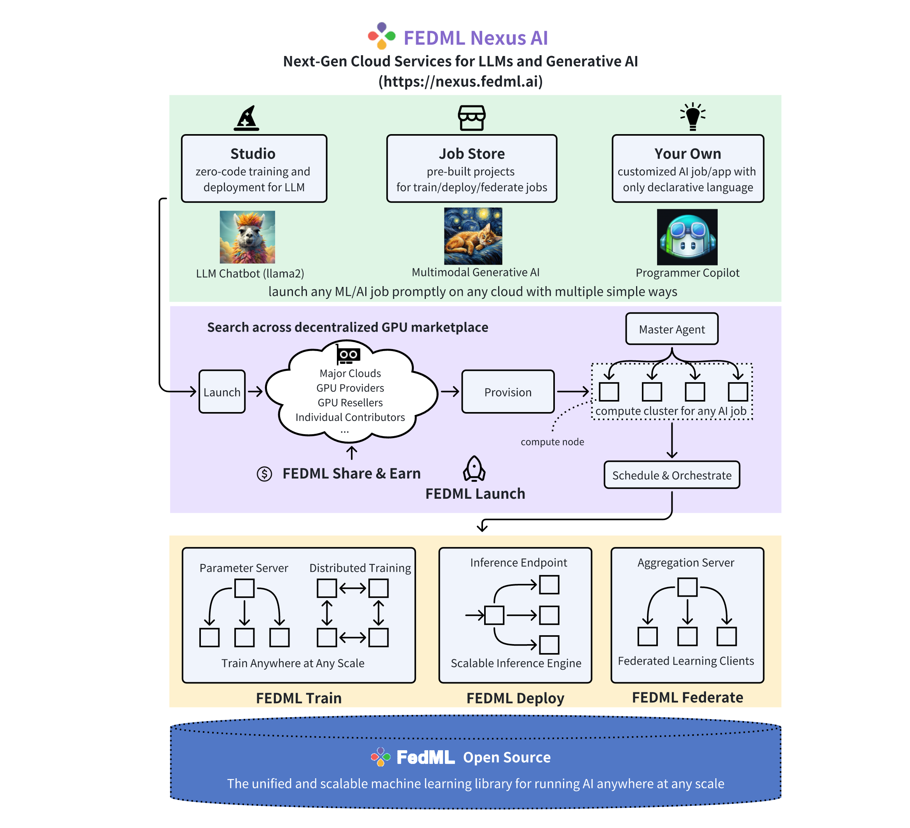

# FEDML Open Source: A Unified and Scalable Machine Learning Library for Running Training and Deployment Anywhere at Any Scale

Backed by FEDML Nexus AI: Next-Gen Cloud Services for LLMs & Generative AI (https://fedml.ai)

 

FedML Documentation: https://doc.fedml.ai 

FedML Homepage: https://fedml.ai/ \
FedML Blog: https://blog.fedml.ai/ \
FedML Medium: https://medium.com/@FedML \
FedML Research: https://fedml.ai/research-papers/ 

Join the Community: \
Slack: https://join.slack.com/t/fedml/shared_invite/zt-havwx1ee-a1xfOUrATNfc9DFqU~r34w \
Discord: https://discord.gg/9xkW8ae6RV

FEDML® stands for Foundational Ecosystem Design for Machine Learning. [FEDML Nexus AI](https://fedml.ai) is the next-gen cloud service for LLMs & Generative AI. It helps developers to *launch* complex model *training*, *deployment*, and *federated learning* anywhere on decentralized GPUs, multi-clouds, edge servers, and smartphones, *easily, economically, and securely*.

Highly integrated with [FEDML open source library](https://github.com/fedml-ai/fedml), FEDML Nexus AI provides holistic support of three interconnected AI infrastructure layers: user-friendly MLOps, a well-managed scheduler, and high-performance ML libraries for running any AI jobs across GPU Clouds.

A typical workflow is showing in figure above. When developer wants to run a pre-built job in Studio or Job Store, FEDML®Launch swiftly pairs AI jobs with the most economical GPU resources, auto-provisions, and effortlessly runs the job, eliminating complex environment setup and management. When running the job, FEDML®Launch orchestrates the compute plane in different cluster topologies and configuration so that any complex AI jobs are enabled, regardless model training, deployment, or even federated learning. FEDML®Open Source is unified and scalable machine learning library for running these AI jobs anywhere at any scale. 

In the MLOps layer of FEDML Nexus AI
- **FEDML® Studio** embraces the power of Generative AI! Access popular open-source foundational models (e.g., LLMs), fine-tune them seamlessly with your specific data, and deploy them scalably and cost-effectively using the FEDML Launch on GPU marketplace.
- **FEDML® Job Store** maintains a list of pre-built jobs for training, deployment, and federated learning. Developers are encouraged to run directly with customize datasets or models on cheaper GPUs.

In the scheduler layer of FEDML Nexus AI
- **FEDML® Launch** swiftly pairs AI jobs with the most economical GPU resources, auto-provisions, and effortlessly runs the job, eliminating complex environment setup and management. It supports a range of compute-intensive jobs for generative AI and LLMs, such as large-scale training, serverless deployments, and vector DB searches. FEDML Launch also facilitates on-prem cluster management and deployment on private or hybrid clouds.

In the Compute layer of FEDML Nexus AI
- **FEDML® Deploy** is a model serving platform for high scalability and low latency.
- **FEDML® Train** focuses on distributed training of large and foundational models.
- **FEDML® Federate** is a federated learning platform backed by the most popular federated learning open-source library and the world’s first FLOps (federated learning Ops), offering on-device training on smartphones and cross-cloud GPU servers.
- **FEDML® Open Source** is unified and scalable machine learning library for running these AI jobs anywhere at any scale.

# Contributing 
FedML embraces and thrive through open-source. We welcome all kinds of contributions from the community. Kudos to all of <a href="https://github.com/fedml-ai/fedml/graphs/contributors" target="_blank">our amazing contributors</a>!  
FedML has adopted [Contributor Covenant](https://github.com/FedML-AI/FedML/blob/master/CODE_OF_CONDUCT.md).
