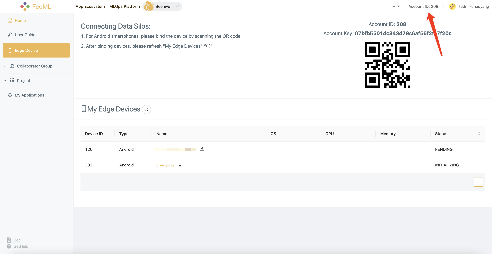
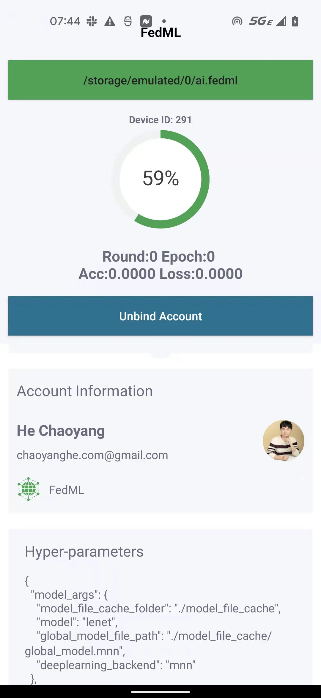

# FedML Android SDK

- Android project root path: https://github.com/FedML-AI/FedML/tree/master/android

The architecture is divided into three vertical layers and multiple horizontal modules:

### 1. Android APK Layer
- app

https://github.com/FedML-AI/FedML/tree/master/android/app


- fedmlsdk_demo

https://github.com/FedML-AI/FedML/tree/master/android/fedmlsdk_demo

### 2. Android SDK layer (Java API + JNI + So library)

https://github.com/FedML-AI/FedMLAndroidSDK


### 3. MobileNN: FedML Mobile Training Engine Layer (C++, MNN, PyTorch, etc.)

https://github.com/FedML-AI/MobileNN

https://github.com/FedML-AI/MNN

https://github.com/FedML-AI/pytorch

At this stage, the app layer is open sourced, the Android SDK is released to the open source community, and the Mobile NN C++ layer is close source.

## Get Started 

`android/fedmlsdk_demo` is a short tutorial for integrating Android SDK for your host App.

1. add repositories by maven

```groovy
    maven { url 'https://s01.oss.sonatype.org/content/repositories/snapshots' }
```

2. add dependency in build.gradle 

check `android/fedmlsdk_demo/build.gradle` as an example:

```groovy
    implementation 'ai.fedml:fedml-edge-android:1.0.0-SNAPSHOT'
```

3. add FedML account id to meta-data in AndroidManifest.xml

check `android/fedmlsdk_demo/src/main/AndroidManifest.xml` as an example:


```xml

<meta-data android:name="fedml_account" android:value="208" />
```

or

```xml

<meta-data android:name="fedml_account" android:resource="@string/fed_ml_account" />
```

You can find your account ID at FedML Open Platform (https://open.fedml.ai):


4. initial FedML Android SDK on your `Application` class.

Taking `android/fedmlsdk_demo/src/main/java/ai/fedml/edgedemo/App.java` as an example:
```java
package ai.fedml.edgedemo;

import android.app.Application;
import android.os.Handler;
import android.os.Looper;

import ai.fedml.edge.FedEdgeManager;

public class App extends Application {
    private static Handler sHandler = new Handler(Looper.getMainLooper());

    @Override
    public void onCreate() {
        super.onCreate();
        
        // initial Edge SDK
        FedEdgeManager.getFedEdgeApi().init(this);
        
        // set data path (to prepare data, please check this script `android/data/prepare.sh`)
        FedEdgeManager.getFedEdgeApi().setPrivatePath(Environment.getExternalStorageDirectory().getPath()
                + "/ai.fedml/device_1/user_0");
    }
}
```

## Android SDK APIs 
At the current stage, we provide high-level APIs with the following three classes.


- ai.fedml.edge.FedEdgeManager

This is the top APIs in FedML Android SDK, it supports core training engine and related control commands on your Android devices.

- ai.fedml.edge.OnTrainProgressListener

This is the message flow to interact between FedML Android SDK and your host APP.

- ai.fedml.edge.request.RequestManager

This is used to to connect your Android SDK with FedML Open Platform (https://open.fedml.ai), which helps you to simplify the deployment, edge collaborative training, experimental tracking, and more.

You can import them in your Java/Android projects as follows. See [android/fedmlsdk_demo/src/main/java/ai/fedml/edgedemo/ui/main/MainFragment.java](fedmlsdk_demo/src/main/java/ai/fedml/edgedemo/ui/main/MainFragment.java) as an example.
```
import ai.fedml.edge.FedEdgeManager;
import ai.fedml.edge.OnTrainProgressListener;
import ai.fedml.edge.request.RequestManager;
```

4. Running Android SDK Demo with MLOps (https://open.fedml.ai)

Please follow this tutorial (https://doc.fedml.ai/mlops/user_guide.html) to start training using FedML BeeHive Platform.




## About Authors

FedML team starts working on Android Platform from year 2009, the beginning of Android Pixel One smartphone (yeah, we are fans of Google Android). 
We are good at industrial grade Android development. See CTO and Senior Android Engineer's project experience in Android at https://chaoyanghe.com/industrial-experience/.


## Want More Advanced APIs or Features?
We'd love to listen to your feedback!

FedML team has rich experience in Android Platform and Federated Learning Algorithmic Research. 
If you want advanced feature supports, please send emails to avestimehr@fedml.ai and ch@fedml.ai
