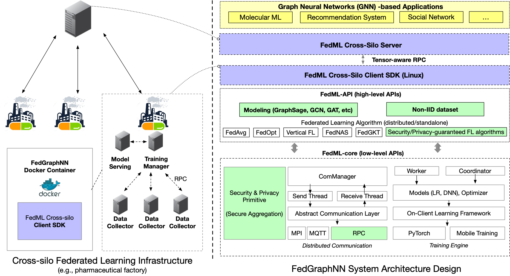

# FedGraphNN: A Federated Learning System and Benchmark for Graph Neural Networks
A Research-oriented Federated Learning Library and Benchmark Platform for Graph Neural Networks. 
Accepted to ICLR'21-DPML and MLSys21 - GNNSys'21 workshops. 

## Introduction 

<div align="center">
 
</div>

Graph Neural Network (GNN) research is rapidly growing thanks to the capacity of GNNs in learning distributed representations from graph-structured data. However, centralizing a massive amount of real-world graph data for GNN training is prohibitive due to privacy concerns, regulation restrictions, and commercial competitions. Federated learning (FL), a trending distributed learning paradigm, provides possibilities to solve this challenge while preserving data privacy. Despite recent advances in vision and language domains, there is no suitable platform for the FL of GNNs. To this end, we introduce FedGraphNN, an open FL benchmark system that can facilitate research on federated GNNs. FedGraphNN is built on a unified formulation of graph FL and contains a wide range of datasets from different domains, popular GNN models, and FL algorithms, with secure and efficient system support. Particularly for the datasets, we collect, preprocess, and partition 36 datasets from 7 domains, including both publicly available ones and specifically obtained ones such as hERG and Tencent. Our empirical analysis showcases the utility of our benchmark system, while exposing significant challenges in graph FL: federated GNNs perform worse in most datasets with a non-IID split than centralized GNNs; the GNN model that attains the best result in the centralized setting may not maintain its advantage in the FL setting. These results imply that more research efforts are needed to unravel the mystery behind federated GNNs. Moreover, our system performance analysis demonstrates that the FedGraphNN system is computationally efficient and secure to large-scale graphs datasets.

## Prerequisites

Install fedml library:
```
pip install fedml
```

Then, install  PyTorch Geometric library via a virtual environment:
```
conda install pyg -c pyg
```

## FedGraphNN Experiments and Use Cases

1. Graph-Level
      1. **MoleculeNet Property Prediction**
         1.  [Graph Classification](./moleculenet_graph_clf/README.md) 
         2.  [Graph Regression](./moleculenet_graph_reg/README.md) 
      2.  **Social Networks**
          1.  [Graph Classification](./social_networks_graph_clf/README.md)
2. Subgraph-Level
      1. **Recommendation Systems**
         1. [Link Prediction](./recsys_subgraph_link_pred/README.md)
3. Node-Level
      1. **Ego Networks (Citation & Coauthor Networks)**
         1. [Link Prediction](./ego_networks_link_pred/README.md)
         2. [Node Classification](./ego_networks_node_clf/README.md)

## How to Add Your Own Model?
Our framework supports [PyTorch](./moleculenet_graph_clf/model/gcn_readout.py) and [PyTorch Geometric](./social_networks_graph_clf/model/gin.py) based models. To add your own specific model, 

1. Create a Pytorch/PyG model and place it under `model` folder.
2. Prepare a [trainer module](./recsys_subgraph_link_pred/trainer/fed_subgraph_lp_trainer.py) by inheriting the base class `ClientTrainer`.
3. Prepare an experiment file similar to `torch_*.py` and shell script similar to `run_*.sh`.
4. Adjust the `fedml_config.yaml` file with the model-specific parameters.

## How to Add More Datasets, Domain-Specific Splits & Non-I.I.D.ness Generation Mechanisms?
If it is a dataset natively supported by PyG, please see [data loader example Python file](./social_networks_graph_clf/data/data_loader.py)

Otherwise, create new folder for your dataset under `data/` folder and provide utilities to before feeding the data to federated pre-processing utilities  listed in `data/data_loader.py` based on your new dataset.

Splits and Non-I.I.D.'ness methods specific to each task are also located under `data/data_loader.py`. By default, we provide I.I.D. and non-I.I.D. sampling(`create_non_uniform_split.py` , Dirichlet distribution sampling) based on sample size of the dataset. To create custom splitting method based on the sample size, you can create a new function or modify `create_non_uniform_split.py` function.

## Code Structure of FedGraphNN
<!-- Note: Each application have their specific configurations. Here, we list the common structure. For more details,. -->

- `config`: Experiment and GPU mapping configurations.

- `data`: Data downloading and preprocessing scripts supporting both PyTorch and PyG format. 

- `model`: GNN models written in Pytorch/PyG.

- `trainer`: Trainer functions  `ClientTrainer`. Some tasks can share the same trainer.

## Citation
Please cite our FedML and FedGraphNN papers if it helps your research.
```
@misc{he2021fedgraphnn,
      title={FedGraphNN: A Federated Learning System and Benchmark for Graph Neural Networks}, 
      author={Chaoyang He and Keshav Balasubramanian and Emir Ceyani and Carl Yang and Han Xie and Lichao Sun and Lifang He and Liangwei Yang and Philip S. Yu and Yu Rong and Peilin Zhao and Junzhou Huang and Murali Annavaram and Salman Avestimehr},
      year={2021},
      eprint={2104.07145},
      archivePrefix={arXiv},
      primaryClass={cs.LG}
}

@misc{he2020fedml,
      title={FedML: A Research Library and Benchmark for Federated Machine Learning}, 
      author={Chaoyang He and Songze Li and Jinhyun So and Xiao Zeng and Mi Zhang and Hongyi Wang and Xiaoyang Wang and Praneeth Vepakomma and Abhishek Singh and Hang Qiu and Xinghua Zhu and Jianzong Wang and Li Shen and Peilin Zhao and Yan Kang and Yang Liu and Ramesh Raskar and Qiang Yang and Murali Annavaram and Salman Avestimehr},
      year={2020},
      eprint={2007.13518},
      archivePrefix={arXiv},
      primaryClass={cs.LG}
}
```

## Contact

Please find contact information at the [homepage](https://github.com/FedML-AI/FedML#join-the-community).