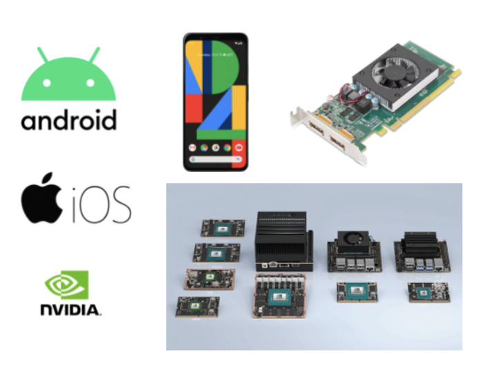
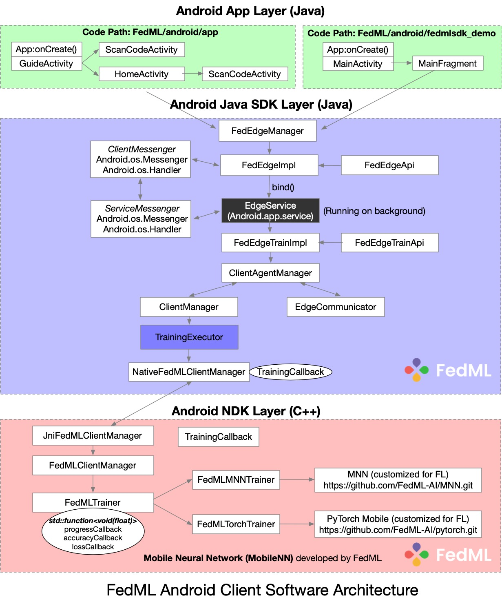
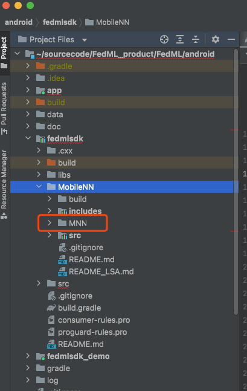
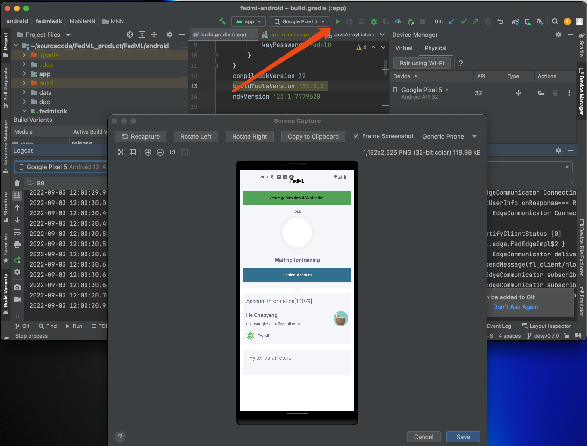
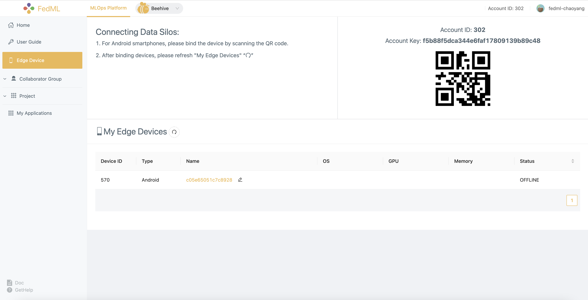
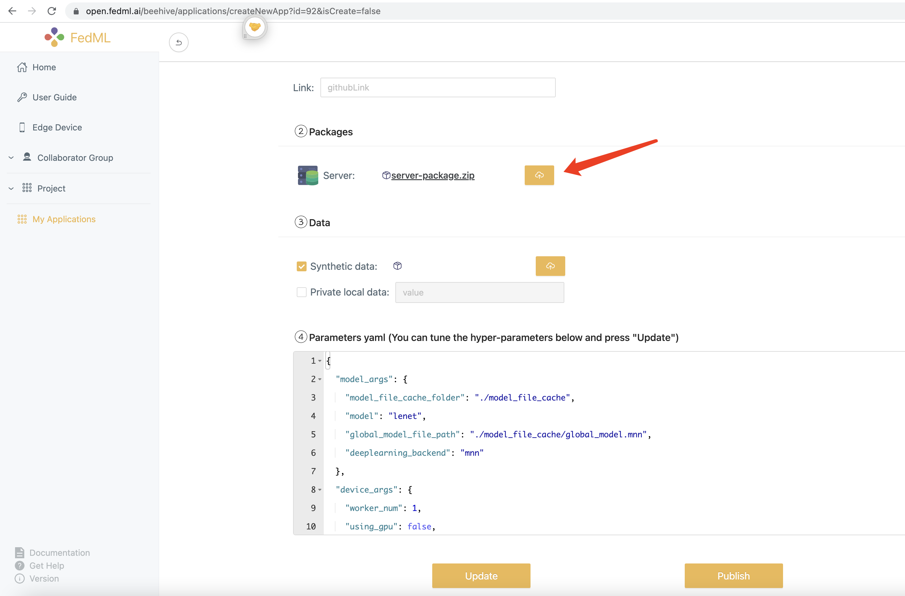
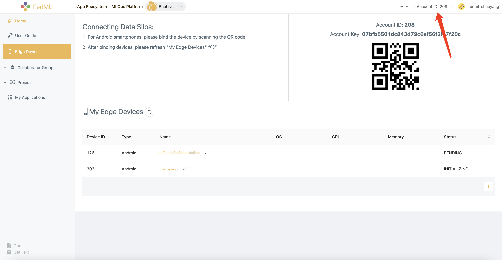

# Federated Learning on Android Smartphones


<table>
<tr>
<td valign="center">

</td>
<td valign="center">

</td>
</tr>
</table>

This example will guide you to work through how to run federated learning on Android smartphones.
The code for this example locates in the following two paths:

Android Client (App) and SDK: [https://github.com/FedML-AI/FedML/tree/master/android](https://github.com/FedML-AI/FedML/tree/master/android)


- App: [https://github.com/FedML-AI/FedML/tree/master/android/app](https://github.com/FedML-AI/FedML/tree/master/android/app)


- fedmlsdk_demo: [https://github.com/FedML-AI/FedML/tree/master/android/fedmlsdk_demo](https://github.com/FedML-AI/FedML/tree/master/android/app)


- Android SDK layer (Java API + JNI + So library):
[https://github.com/FedML-AI/FedML/tree/master/android/fedmlsdk](https://github.com/FedML-AI/FedML/tree/master/android/fedmlsdk)


- MobileNN: FedML Mobile Training Engine Layer (C++, MNN, PyTorch, etc.): \
[https://github.com/FedML-AI/FedML/tree/master/android/fedmlsdk/MobileNN](https://github.com/FedML-AI/FedML/tree/master/android/fedmlsdk/MobileNN) \
[https://github.com/FedML-AI/MNN](https://github.com/FedML-AI/MNN) \
[https://github.com/FedML-AI/pytorch](https://github.com/FedML-AI/pytorch)

Python Server: [https://github.com/FedML-AI/FedML/tree/master/python/quick_start/beehive](https://github.com/FedML-AI/FedML/tree/master/python/quick_start/beehive)

The software architecture design for Android App/SDK is illustrated in the figure below.



Next show you the step-by-step user experiment of using FedML Beehive.


## 1. Setup Environment and Run Android App or Android Demo

### 1.1 Android Installation
- Step 1: Install Android Studio - [https://developer.android.com/studio/install](https://developer.android.com/studio/install)


- Step 2: Setup Android SDK \
[https://developer.android.com/about/versions/12/setup-sdk](https://developer.android.com/about/versions/12/setup-sdk)
[https://developer.android.com/studio/releases/platforms](https://developer.android.com/studio/releases/platforms) (we are using API 32 starting from August 2022)


- Step 3: Setup Android NDK and CMake - https://developer.android.com/studio/projects/install-ndk

### 1.2 Compile and Build
- Clone customized MNN library ([https://github.com/FedML-AI/MNN](https://github.com/FedML-AI/MNN)) into `FedML/android/fedmlsdk/MobileNN/MNN` (shown as below)



- Compile and Build Android NDK layer by clicking "Make Project"


- Start to run if your Android smartphone is connected properly.



## 2. Bind FedML Android App to FedML MLOps Platform

This section guides you through 1) installing Android Apk, 2) binding your Android smartphone devices to FedML MLOps Platform, and 3) set the data path for training.

### 2.1 Connect Android App with FedML MLOps Platform
After installing FedML Android App ([https://github.com/FedML-AI/FedML/tree/master/android/app](https://github.com/FedML-AI/FedML/tree/master/android/app)), please go to the MLOps platform ([https://open.fedml.ai](https://open.fedml.ai)) - Beehive and switch to the `Edge Devices` page, you can see a list of **My Edge Devices** at the bottom, as well as a QR code and **Account ID:XXX** at the top right.



You can also see the binding devices in **My Edge Devices** list on the web page.


## 3 Install Synthetic Data and Set the Data Path

### 3.1 Transferring data to mobile devices

You can download the required data and transfer it to the specified directory of the device with the following command:

```shell
# under `FedML/android/data` folder
bash prepare.sh
```

`prepare.sh` is as follows:

```shell
MNIST_DIR=mnist
CIFAR10_DIR=cifar10
ANDROID_DIR=/sdcard/ai.fedml

rm -rf $MNIST_DIR
mkdir $MNIST_DIR
wget http://yann.lecun.com/exdb/mnist/train-images-idx3-ubyte.gz -P $MNIST_DIR
wget http://yann.lecun.com/exdb/mnist/train-labels-idx1-ubyte.gz -P $MNIST_DIR

rm -rf $CIFAR10_DIR
rm -rf cifar-10-binary.tar.gz
wget wget https://www.cs.toronto.edu/~kriz/cifar-10-binary.tar.gz
tar -xzvf cifar-10-binary.tar.gz
mv cifar-10-batches-bin $CIFAR10_DIR

adb push $MNIST_DIR $ANDROID_DIR
adb push $CIFAR10_DIR $ANDROID_DIR
```

The MNIST dataset folder and the CIFAR-10 dataset folder can be moved to `/sdcard/ai` by running the above script. 

### 3.2 Set the Data Path


To set data path on your device, click the top green bar. Set it as the path to the corresponding dataset moved to the Android device (find the folder name starting from ai.fedml).

#### 3. **Deploy FL Server**

- Create an account at FedML MLOps Platform ([https://open.fedml.ai](https://open.fedml.ai))

- Run local test fo

- Build Python Server Package and Upload to FedML MLOps Platform ("Create Application")

Our example code is provided at:
[https://github.com/FedML-AI/FedML/tree/master/python/quick_start/beehive](https://github.com/FedML-AI/FedML/tree/master/python/quick_start/beehive)

1) First, you need to have sanity check of this example to make it bug free. By default, the server code example is bug free. 

Note that this example relies on MNN library (https://pypi.org/project/MNN/). It can only support python 3.7. So make sure to test this server code example under python 3.7 environment.

2) Second, please build the server package by running the following command:


```
bash build_mlops_pkg.sh
```
After correct execution, you can find the package `server-package.zip` under `mlops` folder. 

3) Then you need to upload the `server-package.zip` package to FedML MLOps Platform as the UI shown below.




- Launch the training by using FedML MLOps ([https://open.fedml.ai](https://open.fedml.ai))

Steps at MLOps: create group -> create project -> create run -> select application (the one we uploaded server package for Android) -> start run

On the Android side, you will see training status if every step works correctly.

## 4. Get Started with Integrating Android SDK for Your Host App

`android/fedmlsdk_demo` is a short tutorial for integrating Android SDK for your host App.

1. add repositories by maven

```groovy
    maven { url 'https://s01.oss.sonatype.org/content/repositories/snapshots' }
```

2. add dependency in build.gradle 

check `android/fedmlsdk_demo/build.gradle` as an example:

```groovy
    implementation 'ai.fedml:fedml-edge-android:1.1.0-SNAPSHOT'
```

3. add FedML account id to meta-data in AndroidManifest.xml

check `android/fedmlsdk_demo/src/main/AndroidManifest.xml` as an example:


```xml

<meta-data android:name="fedml_account" android:value="208" />
```

or

```xml

<meta-data android:name="fedml_account" android:resource="@string/fed_ml_account" />
```

You can find your account ID at FedML Open Platform (https://open.fedml.ai):


4. initial FedML Android SDK on your `Application` class.

Taking `android/fedmlsdk_demo/src/main/java/ai/fedml/edgedemo/App.java` as an example:
```java
package ai.fedml.edgedemo;

import android.app.Application;
import android.os.Handler;
import android.os.Looper;

import ai.fedml.edge.FedEdgeManager;

public class App extends Application {
    private static Handler sHandler = new Handler(Looper.getMainLooper());

    @Override
    public void onCreate() {
        super.onCreate();
        
        // initial Edge SDK
        FedEdgeManager.getFedEdgeApi().init(this);
        
        // set data path (to prepare data, please check this script `android/data/prepare.sh`)
        FedEdgeManager.getFedEdgeApi().setPrivatePath(Environment.getExternalStorageDirectory().getPath()
                + "/ai.fedml/device_1/user_0");
    }
}
```

## 5. Android SDK APIs 
At the current stage, we provide high-level APIs with the following three classes.


- ai.fedml.edge.FedEdgeManager

This is the top APIs in FedML Android SDK, it supports core training engine and related control commands on your Android devices.

- ai.fedml.edge.OnTrainProgressListener

This is the message flow to interact between FedML Android SDK and your host APP.

- ai.fedml.edge.request.RequestManager

This is used to connect your Android SDK with FedML Open Platform (https://open.fedml.ai), which helps you to simplify the deployment, edge collaborative training, experimental tracking, and more.

You can import them in your Java/Android projects as follows. See [android/fedmlsdk_demo/src/main/java/ai/fedml/edgedemo/ui/main/MainFragment.java](fedmlsdk_demo/src/main/java/ai/fedml/edgedemo/ui/main/MainFragment.java) as an example.
```
import ai.fedml.edge.FedEdgeManager;
import ai.fedml.edge.OnTrainProgressListener;
import ai.fedml.edge.request.RequestManager;
```

## Need More Help?
Join the Community:

Slack: [https://join.slack.com/t/fedml/shared_invite/zt-havwx1ee-a1xfOUrATNfc9DFqU~r34w](https://join.slack.com/t/fedml/shared_invite/zt-havwx1ee-a1xfOUrATNfc9DFqU~r34w)

Discord: [https://discord.gg/9xkW8ae6RV](https://discord.gg/9xkW8ae6RV)