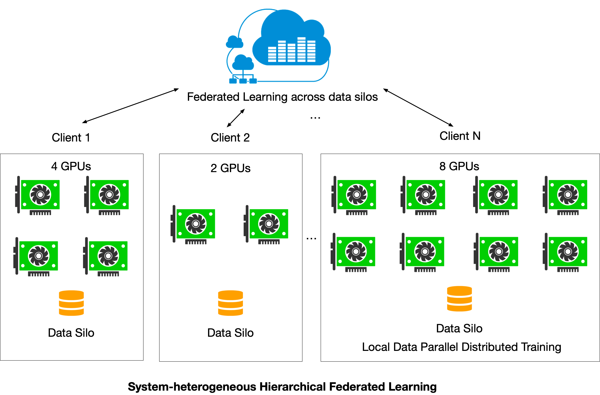

# FedML Octopus Examples

## Horizontal Federated Learning

- [mqtt_s3_fedavg_mnist_lr_example](./examples/mqtt_s3_fedavg_mnist_lr_example.md): an example to illustrate running horizontal federated learning in data silos (hospitals, banks, etc.)

## Hierarchical Federated Learning

- [hierarchical_fedavg_mnist_lr_example](./examples/mqtt_s3_fedavg_hierarchical_mnist_lr_example.md): an example to illustrate running hierarchical federated learning in data silos (hospitals, banks, etc.). 
As shown in the figure below, here `hierarchical` implies that each FL Client (data silo) has multiple GPUs that can run local distributed training with PyTorch DDP, and the FL server then aggregates globally from the results received from all FL Clients. 

