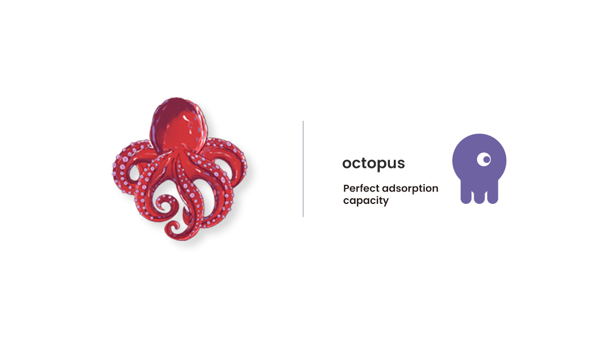
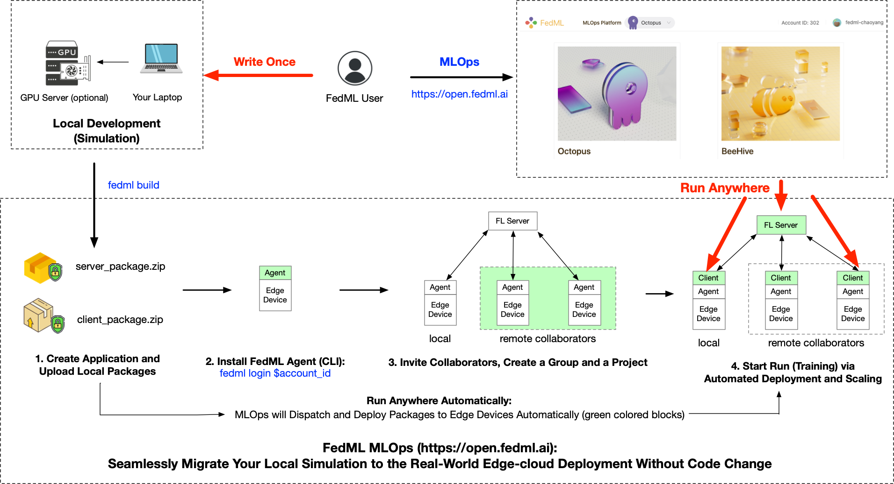

# FedML Octopus User Guide

FedML Octopus is the industrial grade platform of cross-silo federated learning for cross-organization/account training. 
It provides the federated learning service and edge AI SDK for developers or companies to conduct open collaboration from anywhere at any scale in a secure manner. 

## Seamlessly transplant the simulation code (Parrot) to real-world cross-device FL (Octopus)
The most advanced and easy-to-use feature at FedML Octopus is the MLOps support. 
Researchers and engineers do not need to maintain the complex geo-distributed GPU/CPU cluster.
Essentially, Our MLOps can seamlessly migrate the local development to the real-world edge-cloud deployment without code changes. 
A detailed workflow is shown as below. 

You can also read [the tutorial](https://doc.fedml.ai/mlops/user_guide.html)  to see how easy it is to simplify the real-world deployment (including an video tutorial).

## Heterogeneous hierarchical federated learning: supporting local AllReduce-based distributed training
System heterogeneity is one of the key challenges in practical federated learning. All existing open federated learning frameworks do not consider the practical scenario 
where different data silos may have different numbers of GPUs or even multiple nodes (where each node has multiple GPUs), as shown as the figure below. 

FedML Octopus addresses this challenge by enabling a distributed training paradigm (PyTorch DDP, distributed data parallel) to run inside each data-silo, and further orchestrate different silos with asynchronous or synchronous federated optimization method. 
As a result, FedML Octopus can support this scenario in a flexible, secure, and efficient manner. FedML MLOps platform also simplifies its real-world deployment.

Please read the detailed [examples and tutorial](https://doc.fedml.ai/cross-silo/examples.html) for details.

## Diverse Communication Backends for different cross-silo scenario
FedML Octopus supports [diverse communication backends]((https://github.com/FedML-AI/FedML/tree/master/python/fedml/core/distributed/communication)), including MQTT+S3, MQTT, PyTorch RPC, gRPC, and MPI.
These communication backends meet the different demands for high-performance, low latency, and robust connection.
