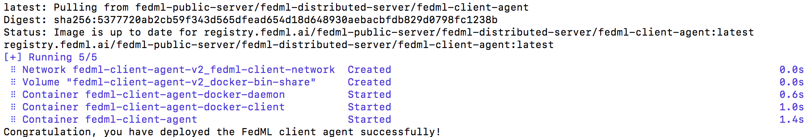

# FedML MLOps User Guide


Figure 1: the workflow that describes how our MLOps works

The above figure shows the workflow. Such a workflow is handled by web UI without the need to handle complex deployment. 
Please follow the following instruction step by step.

```angular2html
1. Install Client Agent and Login
2. Invite Collaborators and group management
3. Project Management 
```

## 1. Install Client Agent and Login

- 1.1 Install Docker Engine (skip this step if you already set it up in your local device)

Please refer to [https://docs.docker.com/get-docker/](https://docs.docker.com/get-docker/)

Note: if you use MacBook, please install according to [this link](https://docs.docker.com/desktop/mac/install/) . Don't use complex command lines.

Open Docker Engine, and make sure `Docker is running`

- 1.2 Register an Account at MLOps

[https://open.fedml.ai/#/login?isRegister=true](https://open.fedml.ai/#/login?isRegister=true)

- 1.3 Launch our docker for FL Client Agent and login it to the platform
```
# download the script for downloading the FL Client Agent 
git clone https://github.com/FedML-AI/fedml_edge_deployment
cd fedml_edge_deployment

# start to pull docker image and run the FL Client Agent
./run.sh $account_id
```
Please change $account_id to your own ID (see the screenshot shown below).


Figure 2: bind your edge devices to our platform

When `run.sh` runs correctly, you will see the log as below. The downloading process takes about 10 seconds.




## 2. Invite Collaborators and group management
- 2.1 Invite Collaborators <br>

(1) Copy your invitation link

(2) Send the invitation link to your collaborators via any communication tools e.g., Slack,  Facebook Messenger, Email.

(3) Your collaborators can open the URL, and accept the invitation
  
Now you and your collaborators should be able to see each other on `My Collaborators` page.


Figure 3: invite your collaborators

- 2.2 Group Management
  
After inviting your collaborators, you can `Create New Group`, input the group name, and select your collaborators into the group.

We support a topology visualization to assist you and your collaborators in checking all collaborative edge devices in that group.

Note that after creation, our platform will add newly bound devices from all members to the group. If you would like to change the members in this group, Please create a new group for it.


Figure 4: showing the topology of the group

## 3. Project Management 
Now let's create a project and get training started!

- Create a new project for a specific group or utilize the existing project you created before
- Open a project and create a new run under the project, by clicking `Start`, the run will get started.


Figure 5: create and start a new run


##### 3.1 Edit Configuration (optional)

As your can see from Figure 5, you may not have configured your hyper-parameters. By click "create configurations", you can customize your Configuration.
Or before starting the run, you can edit your configurations at `Configurations` -> `New Configurations`.

Note that we are working on a couple of default configurations. Later you can either pick the default ones or create your own.


Figure 6: edit your configuration

#### 3.2 Update the source code of Client and Server (Optional)
We also provide the flexibility for you to customize your training algorithm, model, data loader, etc. You can upload the source code in `Server Package` and `Client Package`.

After successfully updating the Server package, `Model` and `Hyper-parameters` will be auto-filled by parsing the Server package.

A tutorial about how to customize the package can be found at:\
[Update the Source Code for FL Client and Server](mlops_update_source_code.md)


#### 3.3 Data Management (synthetic data or private data)
Users can either use the synthetic data or your local private data. 
- Set the private data path
Please change the data path if you prefer to use your local private data.

By default, the private data path is `fedml_data` under `fedml_edge_deployment` folder. 
If you would like to set it to another path, please modify it on the configuration page. 
The path value should be relative to the `fedml_edge_deployment` folder.

- Upload synthetic data. 
Synthetic data can be used for geo-distributed training, meaning that we do not enable privacy-related functionality in such a setting.
Our platform will split the data according to the client number and distribute the data partitions to each client.
  

## 4. Experiment Tracking
Now you are ready to start the training, enjoy! We provide the following experimental tracking abilities as follows.

- monitoring device status and training progress
- visualizing training results
- visualizing system performance
- distributed logging
- model downloading

More advanced features will be supported soon. We appreciate your valuable feedback.


