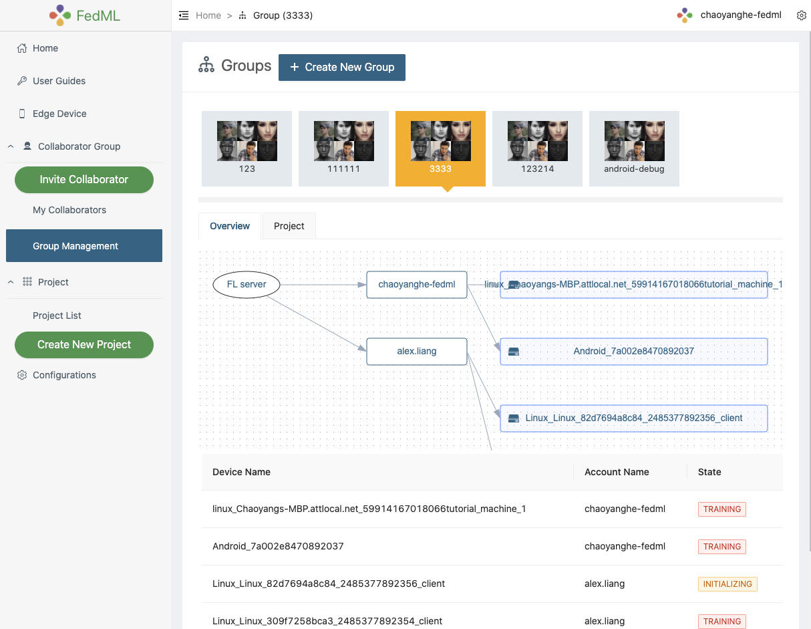
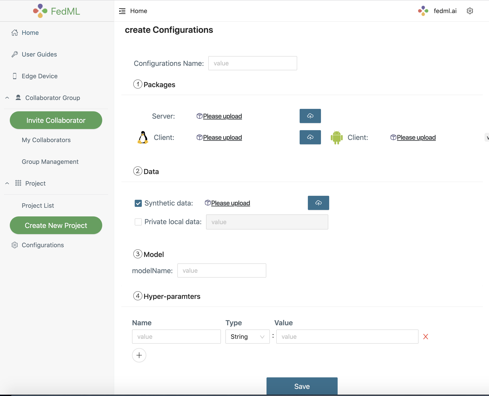

# FedML MLOps User Guide


Figure 1: the workflow that describes how our MLOps works

Such a workflow is handled by web UI without the need to handle complex deployment. 
Please follow the following instruction step by step.

```angular2html
1. Install Client Agent and Login
2. Invite Collaborators and group management
3. Project Management 
```

After you finish the local developing/debugging of the FedML Octopus (cross-silo) project (e.g., successfully run the example [https://doc.fedml.ai/cross-silo/examples/mqtt_s3_fedavg_mnist_lr_example.html](https://doc.fedml.ai/cross-silo/examples/mqtt_s3_fedavg_mnist_lr_example.html)), 
you can now deploy it into the real-world edge-cloud system. Here, we use the cross-silo project example at
[https://github.com/FedML-AI/FedML/tree/master/python/examples/cross_silo/mqtt_s3_fedavg_mnist_lr_example/one_line](https://github.com/FedML-AI/FedML/tree/master/python/examples/cross_silo/mqtt_s3_fedavg_mnist_lr_example/one_line)
to guide you through how to deploy it into the real world and collaborate with others data silos.

## 1. Install Client Agent and Login

- 1.1 Install Docker Engine (skip this step if you already set it up in your local device)

Please refer to [https://docs.docker.com/get-docker/](https://docs.docker.com/get-docker/)

Note: if you use MacBook, please install according to [this link](https://docs.docker.com/desktop/mac/install/) . Don't use complex command lines.

Open Docker Engine, and make sure `Docker is running`

- 1.2 Register an Account at MLOps

[https://open.fedml.ai/#/login?isRegister=true](https://open.fedml.ai/#/login?isRegister=true)

- 1.3 Launch our docker for FL Client Agent and login it to the platform
```
fedml login $userid
```
Please change $userid to your own ID (see the screenshot shown below).


Figure 2: login your edge devices to our platform

You will see the log as below if the script works. The docker image downloading process (for the first time) takes about a few minutes.

```shell
(mnn37) chaoyanghe@Chaoyangs-MBP one_line % fedml login 11
Argument for account Id: 11
Argument for version: release
Deployment version: release
OS Name: MacOS
current dir: /Users/chaoyanghe/sourcecode/FedML_product/FedML-refactor/python/examples/cross_silo/mqtt_s3_fedavg_mnist_lr_example/one_line
The FedML client agent is being deployed, please wait for a moment...
Using docker daemon mode
.........................
dev: Pulling from x6k8q1x9/fedml-client-agent
Digest: sha256:3e0b85844b1f94b180025c7db0ac0356ef4934cd6538b4daca10cfe119929f19
Status: Image is up to date for public.ecr.aws/x6k8q1x9/fedml-client-agent:dev
public.ecr.aws/x6k8q1x9/fedml-client-agent:dev
Congratulations, you have deployed the FedML client agent successfully!
Your device id is C02DK25XMD6N. You may review the device in the MLOps edge device list.
--------------------------------------------------------------------------------------------
Now the system will post-process to pull the FedML client docker image to your localhost.
You may do other things to start your FedML flow. (User Guide: https://doc.fedml.ai)
You just need to keep this window not closed until the processing is finished.
dev: Pulling from x6k8q1x9/fedml-cross-silo-cpu
Digest: sha256:72cc4c2cf1c81c69b75793268a60aed12b067f3fefd17a04bc057941f4ad67c3
Status: Image is up to date for public.ecr.aws/x6k8q1x9/fedml-cross-silo-cpu:dev
public.ecr.aws/x6k8q1x9/fedml-cross-silo-cpu:dev
Great, you have succeeded to complete all the running processes.

```


## 2. Invite Collaborators and group management
- 2.1 Invite Collaborators <br>

(1) Copy your invitation link

(2) Send the invitation link to your collaborators via any communication tools e.g., Slack,  Facebook Messenger, Email.

(3) Your collaborators can open the URL, and accept the invitation
  
Now you and your collaborators should be able to see each other on `My Collaborators` page.


Figure 3: invite your collaborators

- 2.2 Group Management
  
After inviting your collaborators, you can `Create New Group`, input the group name, and select your collaborators into the group.

We support a topology visualization to assist you and your collaborators in checking all collaborative edge devices in that group.

Note that after creation, our platform will add newly bound devices from all members to the group. If you would like to change the members in this group, Please create a new group for it.


Figure 4: showing the topology of the group

## 3. Project Management 
Now let's create a project and get training started!

- Create a new project for a specific group or utilize the existing project you created before
- Open a project and create a new run under the project, by clicking `Start`, the run will get started.


Figure 5: create and start a new run


##### 3.1 Edit Configuration (optional)

As your can see from Figure 5, you may not have configured your hyper-parameters. By click "create configurations", you can customize your Configuration.
Or before starting the run, you can edit your configurations at `Configurations` -> `New Configurations`.

Note that we are working on a couple of default configurations. Later you can either pick the default ones or create your own.


Figure 6: edit your configuration

#### 3.2 Update the source code of Client and Server
We also provide the flexibility for you to customize your training algorithm, model, data loader, etc. You can upload the source code in `Server Package` and `Client Package`.
After successfully updating the Server package, `Model` and `Hyper-parameters` will be auto-filled by parsing the Server package.

The step-by-step instruction to build your customized packages is as follows.

##### 3.2.1. Build Server and Client Package for the FedML MLOps Platform
You can use the following FedML CLI to build the package.
```shell
fedml build -t client -sf $SOURCE -ep $ENTRY -cf $CONFIG -df $DEST

Usage: fedml build [OPTIONS]

  Commands for open.fedml.ai MLOps platform

Options:
  -t, --type TEXT            client or server? (value: client; server)
  -sf, --source_folder TEXT  the source code folder path
  -ep, --entry_point TEXT    the entry point of the source code
  -cf, --config_folder TEXT  the config folder path
  -df, --dest_folder TEXT    the destination package folder path
  --help                     Show this message and exit.
```

The following script uses `examples/cross_silo/mqtt_s3_fedavg_mnist_lr_example/one_line` as an example to illustrate the arguments for building MLOps packages. Please replace related values with your own.

- Build the deployable package for the client
```shell
cd python/examples/cross_silo/mqtt_s3_fedavg_mnist_lr_example/one_line

SOURCE=examples/cross_silo/mqtt_s3_fedavg_mnist_lr_example/one_line/client
ENTRY=torch_client.py
CONFIG=examples/cross_silo/mqtt_s3_fedavg_mnist_lr_example/one_line/config
DEST=./mlops
fedml build -t client -sf $SOURCE -ep $ENTRY -cf $CONFIG -df $DEST
```
If the script works correctly, the console log should be as follows.
```shell
(mnn37) chaoyanghe@Chaoyangs-MBP python % fedml build -t client -sf $SOURCE -ep $ENTRY -cf $CONFIG -df $DEST
Argument for type: client
Argument for source folder: examples/cross_silo/mqtt_s3_fedavg_mnist_lr_example/one_line/client
Argument for entry point: torch_client.py
Argument for config folder: examples/cross_silo/mqtt_s3_fedavg_mnist_lr_example/one_line/config
Argument for destination package folder: ./mlops
Now, you are building the fedml packages which will be used in the MLOps platform.
The packages will be used for client training and server aggregation.
When the building process is completed, you will find the packages in the directory as follows: ./mlops/dist-packages.
Then you may upload the packages on the configuration page in the MLOps platform to start the federated learning flow.
Building...
You have finished all building process. 
Now you may use ./mlops/client-package.zip to start your federated learning run.
```

- Build the deployable package for the server
```shell
SOURCE=examples/cross_silo/mqtt_s3_fedavg_mnist_lr_example/one_line/server
ENTRY=torch_server.py
CONFIG=examples/cross_silo/mqtt_s3_fedavg_mnist_lr_example/one_line/config
DEST=./mlops
fedml build -t server -sf $SOURCE -ep $ENTRY -cf $CONFIG -df $DEST
```
If the script works correctly, the console log should be as follows.
```shell
(mnn37) chaoyanghe@Chaoyangs-MBP python % fedml build -t server -sf $SOURCE -ep $ENTRY -cf $CONFIG -df $DEST
Argument for type: server
Argument for source folder: examples/cross_silo/mqtt_s3_fedavg_mnist_lr_example/one_line/server
Argument for entry point: torch_server.py
Argument for config folder: examples/cross_silo/mqtt_s3_fedavg_mnist_lr_example/one_line/config
Argument for destination package folder: ./mlops
Now, you are building the fedml packages which will be used in the MLOps platform.
The packages will be used for client training and server aggregation.
When the building process is completed, you will find the packages in the directory as follows: ./mlops/dist-packages.
Then you may upload the packages on the configuration page in the MLOps platform to start the federated learning flow.
Building...
You have finished all building process. 
Now you may use ./mlops/server-package.zip to start your federated learning run.
```

The output package locates at
```shell
mlops/dist-packages/client-package.zip
mlops/dist-packages/server-package.zip
```

##### 3.2.2. Explanation of the Configurations

The configuration file includes four sections: `model_config`, `hyperparameters_config`, `entry_config`, `entry_arguments`.

- `model_config`: set your model name such as resnet56, LR, etc. Each value will be replaced with a real-time parameter edited from the MLOps platform (see the figure below).


- `hyperparameters_config`: section, set your hyper-parameters such as learning rate, epochs, etc. 
  These values will also be replaced with real-time parameters edited from the MLOps platform.
  In addition, our MLOps has some "internal variables" received from the UI (see the UI below). Currently, we support the following internal variables:
   
   - ${FEDSYS.CLIENT_NUM}: an integer representing the number of user-selected devices in the MLOps UI.
   - ${FEDSYS_CLIENT_ID_LIST}: client list in one entire Federated Learning flow
   - ${FEDSYS_RUN_ID}: a run id represented one entire Federated Learning flow
   - ${FEDSYS_PRIVATE_LOCAL_DATA}: private local data path in the Federated Learning client
   - ${FEDSYS_SYNTHETIC_DATA_URL}: synthetic data URL from the server, if this value is not null, the client will download data from this URL to use as
   federated training dataset
   - ${FEDSYS_IS_USING_LOCAL_DATA}: whether use private local data as the federated training dataset 


- `entry_config`: set your entry file of the source code in FedML Open Source Library, e.g., `fedml/fedml_experiments/distributed/fedavg_cross_silo/main_fedavg_cross_silo.py`


- `entry_arguments`: the value of each argument is represented with a key from model_config, hyperparameters_config, or internal variables. All the argument variable values
   will be replaced with their actual value. e.g., `model: ${model_config.modelName}` means that the value
   corresponding to the argument name 'model' will be replaced with the value corresponding to the key 'modelName' from the 'model_config' section.


#### 3.3 Data Management (synthetic data or private data)
Users can either use the synthetic data or your local private data. 
- Set the private data path
Please change the data path if you prefer to use your local private data.

By default, the private data path is `fedml_data` under `fedml_edge_deployment` folder. 
If you would like to set it to another path, please modify it on the configuration page. 
The path value should be relative to the `fedml_edge_deployment` folder.

- Upload synthetic data. 
Synthetic data can be used for geo-distributed training, meaning that we do not enable privacy-related functionality in such a setting.
Our platform will split the data according to the client number and distribute the data partitions to each client.
  

## 4. Experiment Tracking
Now you are ready to start the training, enjoy! We provide the following experimental tracking abilities as follows.

- monitoring device status and training progress
- visualizing training results
- visualizing system performance
- distributed logging
- model downloading

More advanced features will be supported soon. We appreciate your valuable feedback.

## 5. The docker-based end-to-end "start run" workflow 

To illustrate how the MLOps system works, we describe the workflow from the "start run" perspective. 


The step-by-step workflow corresponding to the number in the figure is as follows.

1. After you complete your configuration and build the packages, you can upload the server and/or client packages by create your configuration on the Configurations page. 
   Once you create `run` in your project and start the run using the configuration you saved, the workflow shown in the figure is triggered;

2. The MLOps Web UI will send the configuration to the MLOps backend server by HTTP RESTFul API;
   
3. The MLOps backend service then posts the `start_run` message and related configurations to the `FL_Server_Agent` by HTTP RESTFul API;
   
4. The server agent will launch a pre-compiled docker image for the `FL_Server` with the server package obtained from your configuration uploading;
   
5. Once `FL_Server` is launched, `FL_Server_Agent` will send MQTT message to `FL_Client_Agent`; 
   
6. `FL_Client_Agent` then launches a pre-compiled docker image for the `FL_Client` with the client package obtained from your configuration uploading;
 
7. After that, `FL_Client` will send the handshaking messages to `FL_Server` and start the client-server orchestration for training.

Wait for a while, you may review the run overview, device status, training result, system performance, models, and distributed logging.

