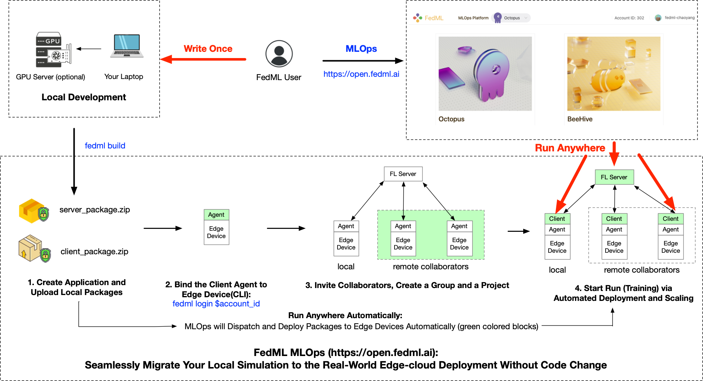
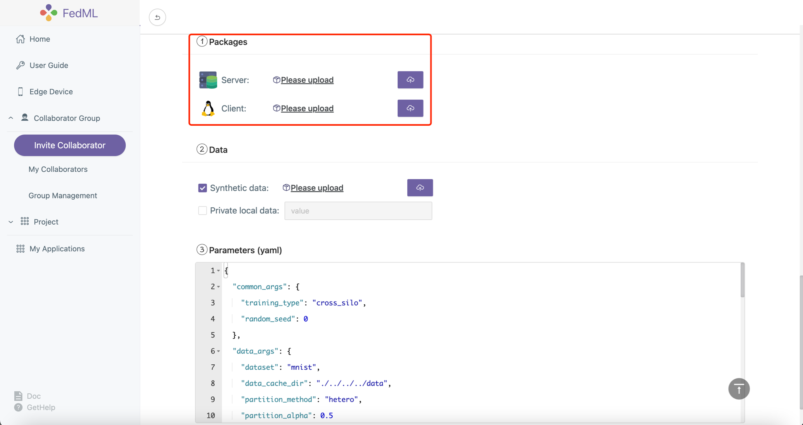
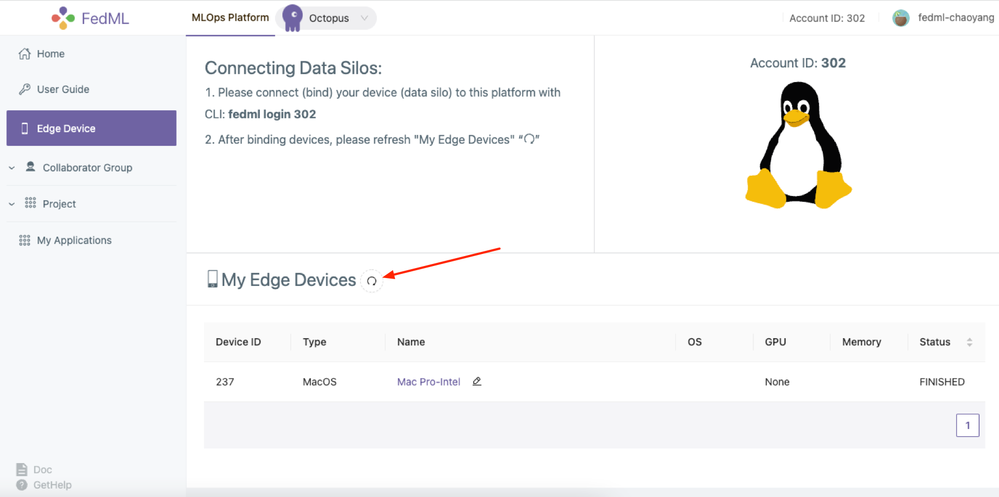
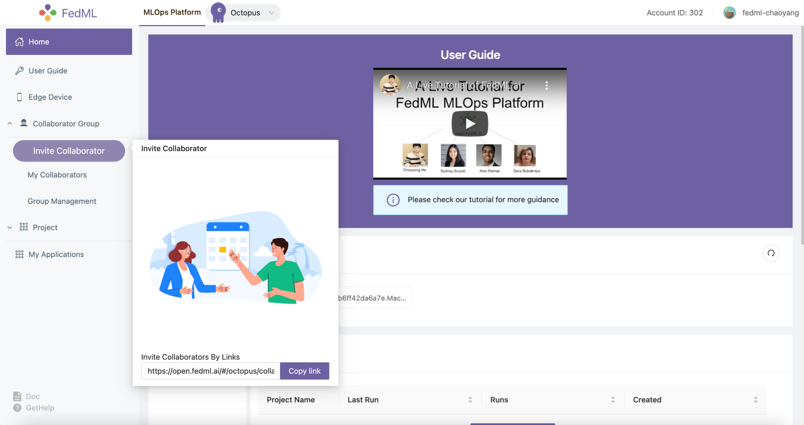
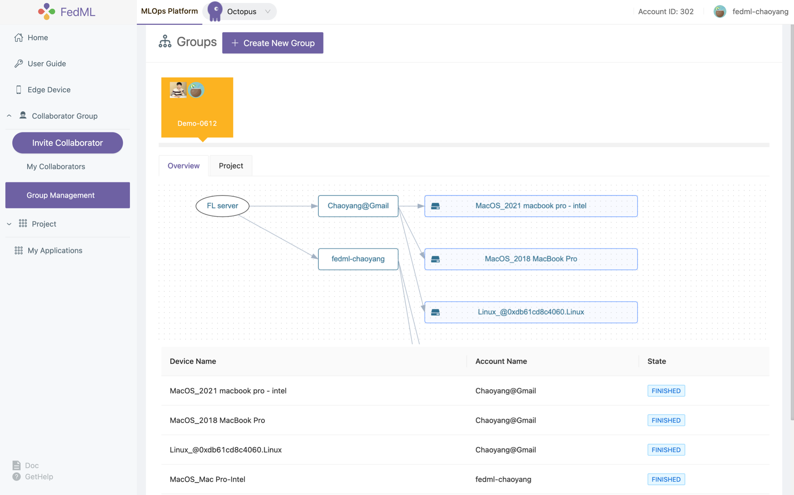
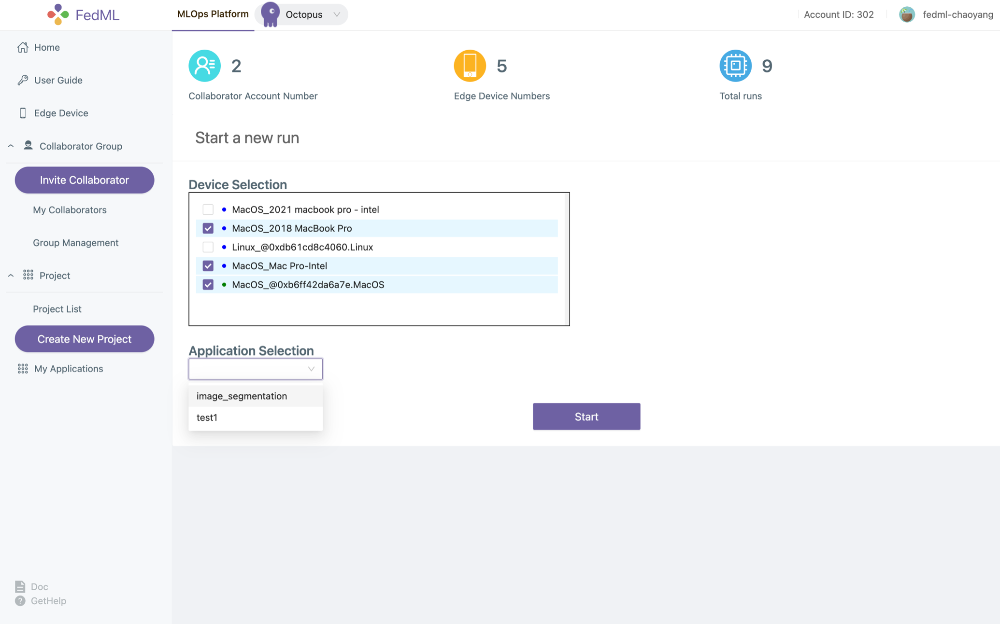
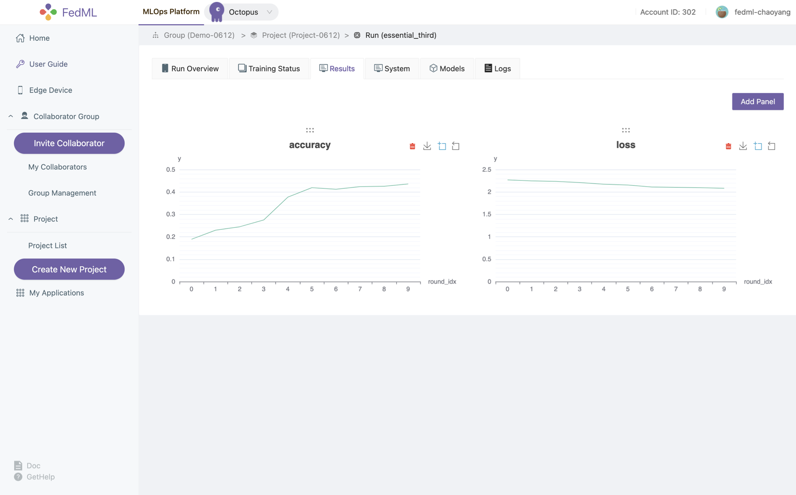
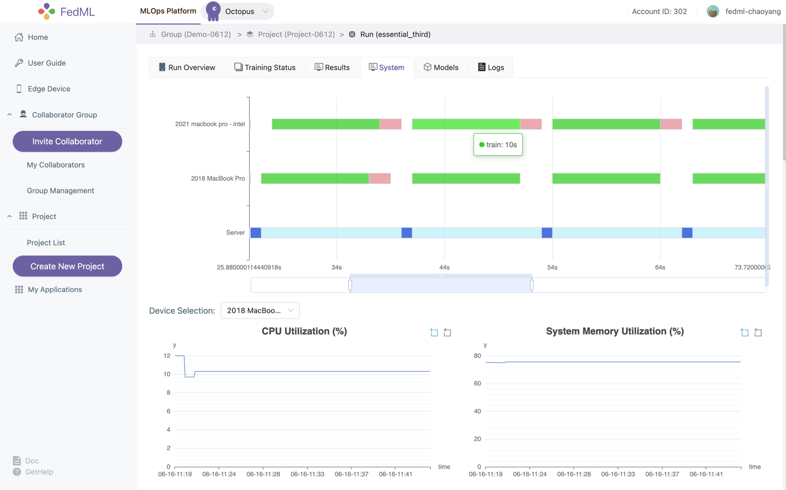
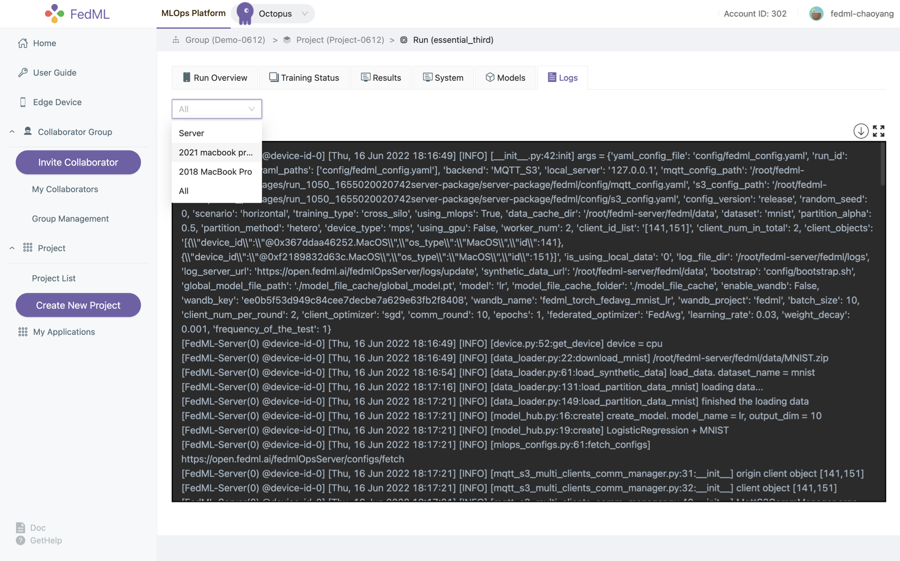

# FedML MLOps User Guide
Video Tutorial:
[https://www.youtube.com/watch?v=Xgm0XEaMlVQ](https://www.youtube.com/watch?v=Xgm0XEaMlVQ)

**Write Once, Run Anywhere: Seamlessly Migrate Your Local Development to the Real-world Edge-cloud Deployment**

- How Does FedML MLOps Platform Work?
- Local Development and Building MLOps Packages
- Create Application and Upload Local Packages
- Install FedML Agent: fedml login $account_id
- Invite Collaborators, Create a Group and a Project
- Start Run (Training) via Automated Deployment and Scaling
- Experimental Tracking via Simplified Project Management


### How Does FedML MLOps Platform Work?
 \
Figure 1: the workflow describing how MLOps works

MLOps works as the figure shown above. Such a workflow is handled by web UI without the need to handle complex deployment. 
Now please register an account and follow the following instruction step by step.

- Instructions for registration: \
Please open [https://open.fedml.ai](https://open.fedml.ai) and find "Sign Up".


### Local Development and Building MLOps Packages

After you finish the local developing/debugging of the FedML project using FedML library (e.g., successfully run the example [https://doc.fedml.ai/cross-silo/examples/mqtt_s3_fedavg_mnist_lr_example.html](https://doc.fedml.ai/cross-silo/examples/mqtt_s3_fedavg_mnist_lr_example.html)), 
you can now deploy it into the real-world edge-cloud system. 

Next, we use the cross-silo project example at
[https://github.com/FedML-AI/FedML/tree/master/python/examples/cross_silo/mqtt_s3_fedavg_mnist_lr_example/one_line](https://github.com/FedML-AI/FedML/tree/master/python/examples/cross_silo/mqtt_s3_fedavg_mnist_lr_example/one_line)
to guide you through how to deploy it and collaborate with others data silos.

### 1. Create Application and Upload Local Packages
 

You can use the following FedML CLI to build the package, and then upload the packages as shown in the figure above.
```shell
fedml build -t client -sf $SOURCE -ep $ENTRY -cf $CONFIG -df $DEST

Usage: fedml build [OPTIONS]

  Commands for open.fedml.ai MLOps platform

Options:
  -t, --type TEXT            client or server? (value: client; server)
  -sf, --source_folder TEXT  the source code folder path
  -ep, --entry_point TEXT    the entry point of the source code
  -cf, --config_folder TEXT  the config folder path
  -df, --dest_folder TEXT    the destination package folder path
  --help                     Show this message and exit.
```

The following script uses `examples/cross_silo/mqtt_s3_fedavg_mnist_lr_example/one_line` as an example to illustrate the arguments for building MLOps packages. Please replace related values with your own.

- Build the deployable package for the client
```shell
cd python/examples/cross_silo/mqtt_s3_fedavg_mnist_lr_example/one_line

SOURCE=client
ENTRY=torch_client.py
CONFIG=config
DEST=./mlops
fedml build -t client -sf $SOURCE -ep $ENTRY -cf $CONFIG -df $DEST
```
Note: for ENTRY, please only specify the file name (torch_client.py) under the SOURCE folder, please do not pass the absolute path.

If the script works correctly, the console log should be as follows.
```shell
(mnn37) chaoyanghe@Chaoyangs-MBP python % fedml build -t client -sf $SOURCE -ep $ENTRY -cf $CONFIG -df $DEST
Argument for type: client
Argument for source folder: examples/cross_silo/mqtt_s3_fedavg_mnist_lr_example/one_line/client
Argument for entry point: torch_client.py
Argument for config folder: examples/cross_silo/mqtt_s3_fedavg_mnist_lr_example/one_line/config
Argument for destination package folder: ./mlops
Now, you are building the fedml packages which will be used in the MLOps platform.
The packages will be used for client training and server aggregation.
When the building process is completed, you will find the packages in the directory as follows: ./mlops/dist-packages.
Then you may upload the packages on the configuration page in the MLOps platform to start the federated learning flow.
Building...
You have finished all building process. 
Now you may use ./mlops/client-package.zip to start your federated learning run.
```

- Build the deployable package for the server
```shell
SOURCE=server
ENTRY=torch_server.py
CONFIG=config
DEST=./mlops
fedml build -t server -sf $SOURCE -ep $ENTRY -cf $CONFIG -df $DEST
```
Note: for ENTRY, please only specify the file name (torch_server.py) under the SOURCE folder, please do not pass the absolute path.

If the script works correctly, the console log should be as follows.
```shell
(mnn37) chaoyanghe@Chaoyangs-MBP python % fedml build -t server -sf $SOURCE -ep $ENTRY -cf $CONFIG -df $DEST
Argument for type: server
Argument for source folder: examples/cross_silo/mqtt_s3_fedavg_mnist_lr_example/one_line/server
Argument for entry point: torch_server.py
Argument for config folder: examples/cross_silo/mqtt_s3_fedavg_mnist_lr_example/one_line/config
Argument for destination package folder: ./mlops
Now, you are building the fedml packages which will be used in the MLOps platform.
The packages will be used for client training and server aggregation.
When the building process is completed, you will find the packages in the directory as follows: ./mlops/dist-packages.
Then you may upload the packages on the configuration page in the MLOps platform to start the federated learning flow.
Building...
You have finished all building process. 
Now you may use ./mlops/server-package.zip to start your federated learning run.
```

The output package locates at `mlops` folder.

### 2. Install FedML Agent: fedml login $account_id

After [installing the FedML library](https://doc.fedml.ai/starter/installation.html) at your edge devices, you can bind it to MLOps platform with a simple CLI:
```
fedml login $account_id
```
Please change $account_id to your own (see the screenshot shown below).


Figure 2: login your edge devices to our platform

In the edge device, you will see the log as below if the script works correctly. You can also press the "refresh" button in Figure 2 to check the status of your device.

```shell
(fedml3.7) chaoyanghe@Chaoyangs-MBP cross_silo % fedml login 302
client None, server None
login as client: True, as server: None
/Users/chaoyanghe/sourcecode/FedML_product/FedML/python/fedml/cli/edge_deployment/client_login.py
(fedml3.7) chaoyanghe@Chaoyangs-MBP cross_silo % Namespace(local_server='127.0.0.1', type='login', user='302', version='release')
Namespace(account_id=302, cloud_region='', config_version='release', current_running_dir='/Users/chaoyanghe/fedml-client', device_id='0xb6ff42da6a7e', local_server='127.0.0.1', log_file_dir='/Users/chaoyanghe/fedml-client/fedml/logs', os_name='MacOS', type='login', user=302, version='release')
Current directory of client agent: /Users/chaoyanghe/fedml-client
client ids:[266]
log file path /Users/chaoyanghe/fedml-client/fedml/logs/fedml-run-0-edge-266-upload.log
login: unique_device_id = @0xb6ff42da6a7e.MacOS
login: edge_id = 266
subscribe: flserver_agent/266/start_train
subscribe: flserver_agent/266/stop_train
subscribe: fl_client/flclient_agent_266/status
Congratulations, you have logged into the FedML MLOps platform successfully!
Your device id is @0xb6ff42da6a7e.MacOS. You may review the device in the MLOps edge device list.
```


## 3. Invite Collaborators, Create a Group and a Project
- 3.1 Invite Collaborators <br>

(1) Copy your invitation link

(2) Send the invitation link to your collaborators via any communication tools e.g., Slack,  Facebook Messenger, Email.

(3) Your collaborators can open the URL, and accept the invitation
  
Now you and your collaborators should be able to see each other on `My Collaborators` page.


Figure 3: invite your collaborators

- 3.2 Group Management
  
After inviting your collaborators, you can `Create New Group`, input the group name, and select your collaborators into the group.

We support a topology visualization to assist you and your collaborators in checking all collaborative edge devices in that group.

Note that after creation, our platform will add newly bound devices from all members to the group. If you would like to change the members in this group, Please create a new group for it.


Figure 4: showing the topology of the group

## 4. Start Run (Training) via Automated Deployment and Scaling
Now let's create a project and get training started!

- Create a new project for a specific group or utilize the existing project you created before
- Open a project and create a new run under the project, by clicking `Start`, the run will get started.


Figure 5: create and start a new run


[//]: # ()
[//]: # (#### 3.3 Data Management &#40;synthetic data or private data&#41;)

[//]: # (Users can either use the synthetic data or your local private data. )

[//]: # (- Set the private data path)

[//]: # (Please change the data path if you prefer to use your local private data.)

[//]: # ()
[//]: # (By default, the private data path is `fedml_data` under `fedml_edge_deployment` folder. )

[//]: # (If you would like to set it to another path, please modify it on the configuration page. )

[//]: # (The path value should be relative to the `fedml_edge_deployment` folder.)

[//]: # ()
[//]: # (- Upload synthetic data. )

[//]: # (Synthetic data can be used for geo-distributed training, meaning that we do not enable privacy-related functionality in such a setting.)

[//]: # (Our platform will split the data according to the client number and distribute the data partitions to each client.)


## 5. Experimental Tracking via Simplified Project Management
Now you are ready to start the training, enjoy! We provide the following experimental tracking abilities as follows.

- monitoring device status (including logging in each device) and training progress


- visualizing training results


- visualizing system performance


- model downloading/serving

- distributed logging



More advanced features will be supported soon. We appreciate your valuable feedback.

[//]: # ()
[//]: # (## 5. The Docker-based End-to-end "start run" Workflow )

[//]: # ()
[//]: # (To illustrate how the MLOps system works, we describe the workflow from the "start run" perspective. )

[//]: # ()
[//]: # (![MLOps Configuration]&#40;../_static/image/backend_mlops.jpeg&#41;)

[//]: # ()
[//]: # (The step-by-step workflow corresponding to the number in the figure is as follows.)

[//]: # ()
[//]: # (1. After you complete your application and build the packages, you can upload the server and/or client packages by create your configuration on the Configurations page. )

[//]: # (   Once you create `run` in your project and start the run using the configuration you saved, the workflow shown in the figure is triggered;)

[//]: # ()
[//]: # (2. The MLOps Web UI will send the configuration in your application to the MLOps backend server by HTTP RESTFul API;)

[//]: # (   )
[//]: # (3. The MLOps backend service then posts the `start_run` message and related configurations to the `FL_Server_Agent` by HTTP RESTFul API;)

[//]: # (   )
[//]: # (4. The server agent will launch a pre-compiled docker image for the `FL_Server` with the server package obtained from your configuration uploading;)

[//]: # (   )
[//]: # (5. Once `FL_Server` is launched, `FL_Server_Agent` will send MQTT message to `FL_Client_Agent`; )

[//]: # (   )
[//]: # (6. `FL_Client_Agent` then launches a pre-compiled docker image for the `FL_Client` with the client package obtained from your configuration uploading;)

[//]: # ( )
[//]: # (7. After that, `FL_Client` will send the handshaking messages to `FL_Server` and start the client-server orchestration for training.)

[//]: # ()
[//]: # (Wait for a while, you may review the run overview, device status, training result, system performance, models, and distributed logging.)

[//]: # ()
