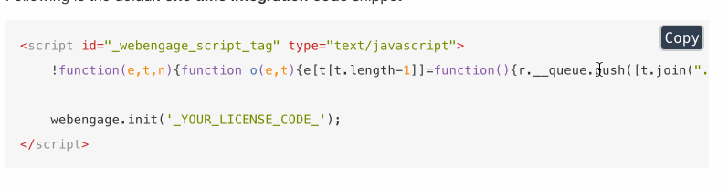

# Copy Code to Clipboard on GitBook

## Install it using:

```$ npm install gitbook-plugin-copy-code-button```

To use it in your book, add this to book.json:
```
{
    "plugins": ["copy-code-button"]
}
```

