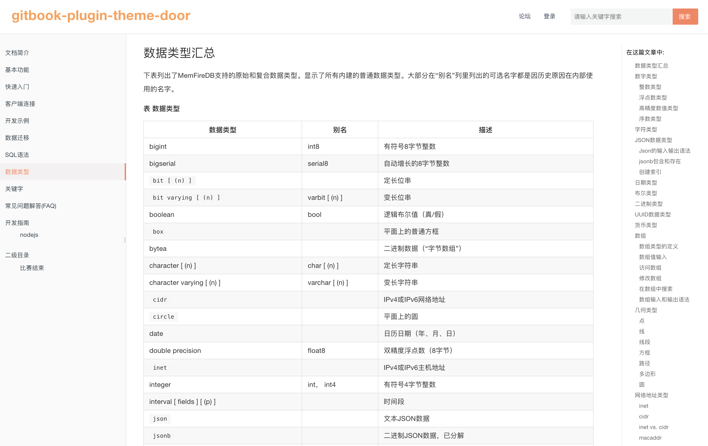

## gitbook-plugin-theme-door
> 含有Header导航，Sidebar导航以及MiniMap导航的gitbook主题。

### 主题样式


### 使用方式
```json
{
  "plugins": [
    "splitter",
    "hide-element",
    "code",
    "theme-door",
    "-lunr",
    "-search",
    "-sharing",
    "search-pro-fixed"
  ],
  "variables": {
    "doorTheme": {
      "nav": [
        {
          "url": "xxxxx",
          "target": "_blank",
          "name": "论坛"
        },
        {
          "url": "xxxxx",
          "target": "_blank",
          "name": "登录"
        }
      ]
    }
  },
  "pluginsConfig": {
    "hide-element": {
      "elements": [".gitbook-link"]
    },
    "doorTheme": {
      "search-placeholder": "请输入关键字搜索",
      "logo": "./_media/logo.svg",
      "favicon": "./_media/favicon.ico"
    }
  }
}
```

