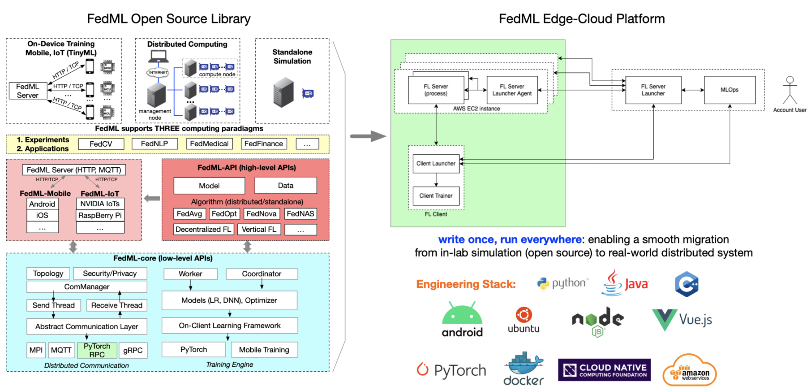

# Get Started

Thank you for coming! This tutorial is a quick tour of FedML Open Source Library ([https://github.com/FedML-AI/FedML](https://github.com/FedML-AI/FedML)) and MLOps Platform ([https://open.fedml.ai](https://open.fedml.ai)) with examples in different scenario. 

## **FedML Feature Overview**


FedML logo reflects the mission of FedML Inc. FedML aims to build simple and versatile APIs for machine learning running anywhere at any scale.
In other words, FedML supports both federated learning for data silos and distributed training for acceleration with MLOps and Open Source support, covering cutting-edge academia research and industrial grade use cases. 

- **FedML Cheetah** - Accelerate Model Training with User-friendly Distributed Training
- **FedML Parrot** - Simulating federated learning in the real world (1) simulate FL using a single process (2) MPI-based FL Simulator (3) NCCL-based FL Simulator (fastest)
- **FedML Octopus** - Cross-silo Federated Learning for cross-organization/account training, including Python-based edge SDK.
- **FedML Beehive** - Cross-device Federated Learning for Smartphones and IoTs, including edge SDK for Android/iOS and embedded Linux.

- **FedML MLOps**: FedML's machine learning operation pipeline for AI running anywhere at any scale.
- **Model Serving**: we focus on providing a better user experience for edge AI.

## **Quick Start for Open Source Library**
[https://github.com/FedML-AI/FedML](https://github.com/FedML-AI/FedML)

### Installation

To get started, let's install FedML first.

```Python
pip install fedml
```
For more installation methods, please refer to [installing FedML](./installation.md).

### Simplified APIs

Our philosophy of API design is to reduce the number of APIs to as few as possible while simultaneously keeping the flexibility.

For Simplicity, FedML Parrot has only one line API as the following example:

```Python
import fedml

if __name__ == "__main__":
    fedml.run_simulation()
```

For flexibility, one-line API can also be expanded into five lines of APIs. Taking FedML Octopus as an example, the FL Client APIs are as follows:

```Python
import fedml
from fedml.cross_silo import Client

if __name__ == "__main__":
    args = fedml.init()

    # init device
    device = fedml.device.get_device(args)

    # load data
    dataset, output_dim = fedml.data.load(args)

    # load model
    model = fedml.model.create(args, output_dim)

    # start training
    client = Client(args, device, dataset, model)
    client.run()

```

With these APIs, you only need to tune the hyper-parameters with the configuration file `fedml_config.yaml`. An example is as follows:
```yaml
common_args:
  training_type: "cross_device"
  using_mlops: false
  random_seed: 0

data_args:
  dataset: "mnist"
  data_cache_dir: "../../../data/mnist"
  partition_method: "hetero"
  partition_alpha: 0.5

model_args:
  model: "lr"
  model_file_cache_folder: "./model_file_cache" # will be filled by the server automatically
  global_model_file_path: "./model_file_cache/global_model.mnn"

train_args:
  federated_optimizer: "FedAvg"
  client_id_list: "[138, 27]"
  client_num_in_total: 1000
  client_num_per_round: 2
  comm_round: 50
  epochs: 1
  batch_size: 100
  batch_num: -1
  client_optimizer: sgd
  learning_rate: 0.03
  weight_decay: 0.001

validation_args:
  frequency_of_the_test: 5

device_args:
  worker_num: 1 # this only reflects on the client number, not including the server
  using_gpu: false

comm_args:
  backend: "MQTT_S3_MNN"

tracking_args:
  log_file_dir: ./log
```

Now let's run some examples as follows to get a sense of how FedML simplifies federated learning in diverse real-world settings.
 
#### **FedML Parrot Examples**
Simulation with a Single Process (Standalone):

- [sp_fedavg_mnist_lr_example](./../simulation/examples/sp_fedavg_mnist_lr_example.md): 
  Simulating FL using a single process in your personal laptop or server. This is helpful when researchers hope to try a quick algorithmic idea in small synthetic datasets (MNIST, shakespeare, etc.) and small models (ResNet-18, Logistic Regression, etc.). 

Simulation with Message Passing Interface (MPI):
- [mpi_torch_fedavg_mnist_lr_example](./../simulation/examples/mpi_torch_fedavg_mnist_lr_example.md): 
  MPI-based Federated Learning for cross-GPU/CPU servers.
  

Simulation with NCCL-based MPI (the fastest training):
- In case your cross-GPU bandwidth is high (e.g., InfiniBand, NVLink, EFA, etc.), we suggest using this NCCL-based MPI FL simulator to accelerate your development. 

#### **FedML Octopu Exampless**
Horizontal Federated Learning:

- [mqtt_s3_fedavg_mnist_lr_example](./../cross-silo/examples/mqtt_s3_fedavg_mnist_lr_example.md): an example to illustrate how to run horizontal federated learning in data silos (hospitals, banks, etc.)

Hierarchical Federated Learning:

- [hierarchical_fedavg_mnist_lr_example](./../cross-silo/examples/hierarchical_fedavg_mnist_lr_example.md): an example to illustrate how to run hierarchical federated learning in data silos (hospitals, banks, etc.). 
Here `hierarchical` means that inside each FL Client (data silo), there are multiple GPUs that can run local distributed training with PyTorch DDP, and then the FL server aggregates globally from the results received from all FL Clients.


#### **FedML Beehive Examples**

- [Federated Learning on Android Smartphones](./../cross-device/examples/mqtt_s3_fedavg_mnist_lr_example.md)


## **MLOps User Guide**
[https://open.fedml.ai](https://open.fedml.ai)

Currently, the project developed based on FedML Octopus (cross-silo) and Beehive (cross-device) can be smoothly deployed into the real-world system using FedML MLOps.

FedML MLOps Platform simplifies the workflow of federated learning anywhere at any scale.
It enables zero-code, lightweight, cross-platform, and provably secure federated learning.
It enables machine learning from decentralized data at various users/silos/edge nodes, without the need to centralize any data to the cloud, hence providing maximum privacy and efficiency.


The above figure shows the workflow. Such a workflow is handled by web UI without the need to handle complex deployment. Check the following live demo for details:


3 Minutes Introduction: [https://www.youtube.com/watch?v=E1k05jd1Tyw](https://www.youtube.com/watch?v=E1k05jd1Tyw)

A detailed guidance for the MLOps can be found at [FedML MLOps User Guide](./../mlops/user_guide.md). 

## **More Resource**

### Open Source Code Architecture
In general, FedML source code architecture follows the paper which won [Best Paper Award at NeurIPS 2020 (FL workshop)](https://chaoyanghe.com/wp-content/uploads/2021/02/NeurIPS-SpicyFL-2020-Baidu-best-paper-award-He-v2.pdf). Its original idea is presented at the live [video](https://www.youtube.com/watch?v=93SETZGZMyI) and 
[white paper](https://arxiv.org/abs/2007.13518) by FedML co-founder Dr. [Chaoyang He](https://chaoyanghe.com). 



After March 2022, FedML has been upgraded as an AI company which aims to provide machine learning capability anywhere at any scale. Now the python version of FedML [https://github.com/FedML-AI/FedML-refactor/tree/master/python](https://github.com/FedML-AI/FedML-refactor/tree/master/python) is reorganized as follows:

**core**: The FedML low-level API package. This package implements distributed computing by communication backend like MPI, NCCL, MQTT, gRPC, PyTorch RPC, and also supports topology management. 
Other low-level APIs related to security and privacy are also supported. All algorithms and Scenarios are built based on the "core" package.

**data**: FedML will provide some default datasets for users to get started. Customization templates are also provided.

**model**: FedML model zoo.

**device**: FedML computing resource management.

**simulation**: FedML parrot can support (1) simulating FL using a single process (2) MPI-based FL Simulator (3) NCCL-based FL Simulator (fastest)

**cross-silo**: Cross-silo Federated Learning for cross-organization/account training

**cross-device**: Cross-device Federated Learning for Smartphones and IoTs

**distributed**: Distributed Training: Accelerate Model Training with Lightweight Cheetah

**serve**: Model serving, tailored for edge inference

**mlops**: APIs related to machine learning operation platform (open.fedml.ai)

**centralized**: Some centralized trainer code examples for benchmarking purposes.

**utils**: Common utilities shared by other modules.

- Reference
```
@article{chaoyanghe2020fedml,
  Author = {He, Chaoyang and Li, Songze and So, Jinhyun and Zhang, Mi and Wang, Hongyi and Wang, Xiaoyang and Vepakomma, Praneeth and Singh, Abhishek and Qiu, Hang and Shen, Li and Zhao, Peilin and Kang, Yan and Liu, Yang and Raskar, Ramesh and Yang, Qiang and Annavaram, Murali and Avestimehr, Salman},
  Journal = {Advances in Neural Information Processing Systems, Best Paper Award at Federate Learning Workshop},
  Title = {FedML: A Research Library and Benchmark for Federated Machine Learning},
  Year = {2020}
}
```

### Publication
FedML’s core technology is backed by years of cutting-edge research represented in 50+ publications in ML/FL Algorithms, Security/Privacy, Systems, and Applications.

1. Vision Paper for High Scientific Impacts
2. System for Large-scale Distributed/Federated Training
3. Training Algorithms for FL
4. Security/privacy for FL
5. AI Applications
A Full-stack of Scientific Publications in ML Algorithms, Security/Privacy, Systems, Applications, and Visionary Impacts

Please check [this publication list](./../resource/papers.md) for details.

### Video (Invited Talks)

- [Trustworthy and Scalable Federated Learning](https://www.youtube.com/watch?v=U3BiuWjhdaU). Federated Learning One World Seminar (FLOW). By Salman Avestimehr

- [Distributed ML for Federated Learning feat](https://www.youtube.com/watch?v=AY7pCYTC8pQ). Chaoyang He. Stanford MLSys Seminar. By Chaoyang He

- [Contributed Talk for FedML Library](https://www.youtube.com/watch?v=93SETZGZMyI). Best Paper Award at NeurIPS 2020 Federated Learning Workshop. By Chaoyang He

### Join the Community

- Join our Slack:

 
<br />

[https://join.slack.com/t/fedml/shared_invite/zt-havwx1ee-a1xfOUrATNfc9DFqU~r34w](https://join.slack.com/t/fedml/shared_invite/zt-havwx1ee-a1xfOUrATNfc9DFqU~r34w)

- Join our WeChat Group:

Our WeChat group exceeds 200 members, please add the following account and ask him to invite you to join. 


### FAQ

We organize the frequently asked questions at [https://github.com/FedML-AI/FedML/discussions](https://github.com/FedML-AI/FedML/discussions). 
Please feel free to ask questions there. We are happy to discuss on supporting your special demands.

### Recruiting
FedML is hiring researchers, engineers, product managers, and related interns.
If you are interested, please apply at [https://fedml.ai/careers](https://fedml.ai/careers).
