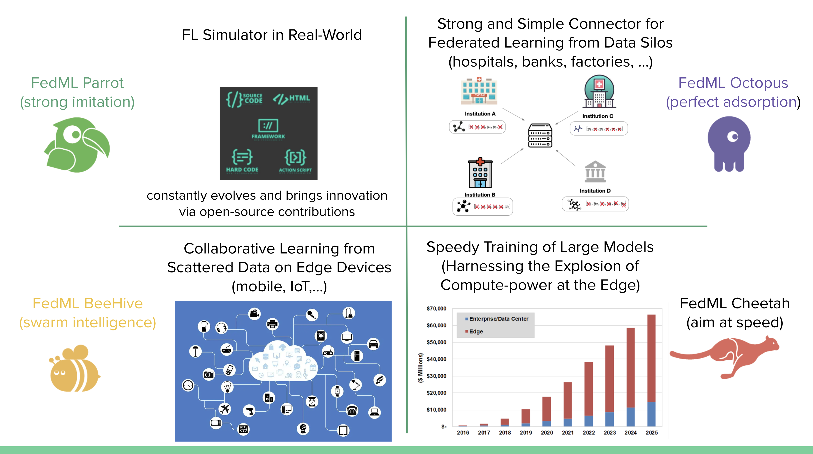

# Mission

FedML builds simple and versatile APIs for machine learning running anywhere at any scale.
In other words, FedML supports both federated learning for data silos and distributed training for acceleration with MLOps and Open Source support, covering cutting-edge academia research and industrial grade use cases. 

- Distributed Training: Accelerate Model Training with Lightweight Cheetah
- Simulator: (1) simulate FL using a single process (2) MPI-based FL Simulator (3) NCCL-based FL Simulator (fastest)
- Cross-silo Federated Learning for cross-organization/account training, including Python-based edge SDK
- Cross-device Federated Learning for Smartphones and IoTs, including edge SDK for Android/iOS and embedded Linux.
- Model Serving: we focus on providing a better user experience for edge AI.
- MLOps: FedML's machine learning operation pipeline for AI running anywhere at any scale.

