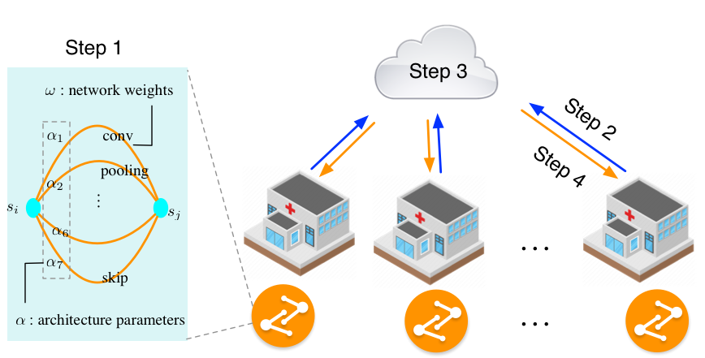
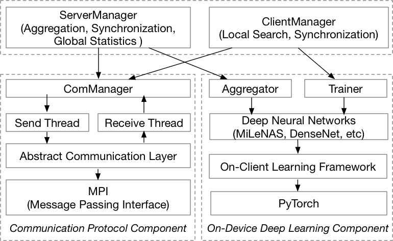

## FedNAS: Federated Deep Learning via Neural Architecture Search
This is the source code for the following paper:
> [FedNAS: Federated Deep Learning via Neural Architecture Search](https://chaoyanghe.com)\
> Chaoyang He, Murali Annavaram, Salman Avestimehr



## 1. AutoFL System Design



We design an AutoFL system based on FedNAS to evaluate our idea. 
The system architecture is shown in the above figure. 
This design separates the communication and the model training into two core components shared by the server and clients. 
The first is the communication protocol component, which is responsible for low-level communication among the server and clients. 
The second is the on-device deep learning component, which is built based on the popular deep learning framework PyTorch. 
These two components are encapsulated as ComManager, Trainer, and Aggregator, providing high-level APIs for the above layers. 
With the help of these APIs, in ClientManager, the client can train or search for better architectures and then send its results to the server-side, while in ServerManager,
 the server can aggregate and synchronize the model architecture and the model parameters with the client-side. 

## 2. Environmental Setups
Our code implementation is based on PyTorch 1.4.0, MPI4Py 3.0.3 (https://pypi.org/project/mpi4py), and Python 3.7.4.

Our experiment tracking platform is supported by Weights and Bias: https://www.wandb.com/


### 2.1 Software Configuration
Here is a step-by-step configuration to help you quickly set up a multi-GPU computing environment.
### **- Conda**

https://docs.conda.io/projects/conda/en/latest/user-guide/getting-started.html
https://docs.conda.io/projects/conda/en/latest/user-guide/cheatsheet.html

### **- PyTorch**

> conda install pytorch torchvision cudatoolkit=10.1 -c pytorch

### **- MPI4py**
> conda install -c anaconda mpi4py

### **- Weights and Bias**
> pip install --upgrade wandb

### **- NFS (Network File System) Configuration**
Please google related installment instructions according to the OS version of your server.

### **- change SSH configuration for your cluster**

- On your local computer (MAC/Windows), generate the public key:
> mkdir ~/.ssh
> ls ~/.ssh
> ssh-keygen -t rsa
> vim ~/.ssh/id_rsa.pub

- Login to the server-side:
> ssh chaoyang@gpumaster-scip.usc.edu

- modify the "authorized_keys"
> vim ~/.ssh/authorized_keys


Paste the string in "id_rsa.pub" file on your local computer to the server side "authorized_keys" file, and save the authorized_keys
> chmod 700 ~/.ssh/
> chmod 600 ~/.ssh/authorized_keys


- login out and login again, you will find you don't need to input the passwords anymore.

For other nodes on your server, use a similar method to configure the SSH.

### **- config MPI host file**
Modify the hostname list in "mpi_host_file" to correspond to your actual physical network topology.
An example: Let us assume a network has a management node and four compute nodes (hostname: node1, node2, node3, node4).
If you want use node1 and node2 to run our program, the "mpi_host_file" should be:
> node1 \
> node2 \
> node3


### 2.2 Hardware Requirements
We set up our experiment in a distributed computing network equipped with GPUs. 
There are 17 nodes in total, one representing the server-side, and the other 16 nodes representing clients, which can be organizations in the real world (e.g., the hospitals). 
Each node is a physical server that has an NVIDIA RTX 2080Ti GPU card inside. 
we assume all the clients join the training process for every communication round.


## 3. Experiments
Once the hardware and software environment are both ready, you can easily use the following command to run FedNAS.
Note:
1. you may find other packages are missing. Please install accordingly by "conda" or "pip".
2. Our default setting is 16 works. Please change parameters in "run_fed_nas_search.sh" based on your own physical servers and requirements.

- Homogeneous distribution (IID) experiment:
```
# search
sh run_fednas_search.sh 4 darts homo 50 5 64

# train
sh run_fednas_train.sh 4 darts homo 500 15 64
```

- Heterogeneous distribution (Non-IID) experiment:
```
# search
sh run_fednas_search.sh 4 darts hetero 50 5 64

# train
sh run_fednas_train.sh 4 darts hetero 500 15 64
```

We can also run code in a single 4 x NVIDIA RTX 2080Ti GPU server. 
In this case, we should decrease the batch size to 2 to guarantee that the total 17 processes can be loaded into the memory. 
The running script for such setting is:
```
# search
sh run_fednas_search.sh 4 darts hetero 50 5 8
```


### 4. Citations
If you use any part of this code in your research or any engineering project, please cite our paper: 

```
FedNAS: Federated Deep Learning via Neural Architecture Search
Chaoyang He, Murali Annavaram, Salman Avestimehr
(Under Review)
```

```
@inproceedings{MiLeNAS,
  title={MiLeNAS: Efficient Neural Architecture Search via Mixed-Level Reformulation},
  author={He, Chaoyang and Ye, Haishan and Shen, Li and Zhang, Tong},
  booktitle={Proceedings of IEEE Conference on Computer Vision and Pattern Recognition (CVPR)},
  year={2020},
}
```


### 5. Contacts
Please feel free to contact me if you meet any problem when using this source code.
I am glad to upgrade the code meet to your requirements if it is reasonable.

I am also open to collaboration based on this elementary system and research idea.

> Chaoyang He \
> http://chaoyanghe.com