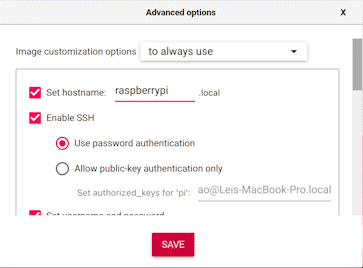

# FedIoT: Federated Learning for Internet of Things
This is the offical implementation of the paper: \
**Federated Learning for Internet of Things: A Federated Learning Framework for On-device Anomaly Data Detection** \
Tuo Zhang*, Chaoyang He*, Tianhao Ma, Lei Gao, Mark Ma, Salman Avestimehr \
(* means co-1st authors) \
accepted to ACM Embedded Networked Sensor Systems SenSys 2021 (AIChallengeIoT) \
[[Proceeding](https://dl.acm.org/doi/pdf/10.1145/3485730.3493444)] [[Arxiv](https://arxiv.org/abs/2106.07976)] \
TLDR: IoT x Federated Learning, from FedML.ai

## Introduction
Due to the heterogeneity, diversity, and personalization of IoT networks, Federated Learning (FL) has a promising future in the IoT cybersecurity field. As a result, we present the FedIoT, an open research platform and benchmark to facilitate FL research in the IoT field. In particular, we propose an autoencoder based trainer to IoT traffic data for anomaly detection. In addition, with the application of federated learning approach for aggregating, we propose an efficient and practical model for the anomaly detection in various types of devices, while preserving the data privacy for each device. What is more, our platform supports three diverse computing paradigms: 1) on-device training for IoT edge devices, 2) distributed computing, and 3) single-machine simulation to meet algorithmic and system-level research requirements under different system deployment scenarios. We hope FedIoT could provide an efficient and reproducible means for developing the implementation of FL in the IoT field. 

Check our slides [here](https://docs.google.com/presentation/d/1aW0GlOhKOl35jMl1KBDjKafJcYjWB-T9fiUsbdBySd4/edit?usp=sharing).
Learn more about Federated Learning for Internet of Things, please check our survey **Federated Learning for Internet of Things: Applications, Challenges, and Opportunities** at [IEEE Xplore](https://ieeexplore.ieee.org/abstract/document/9773116) and [Arxiv](https://arxiv.org/abs/2111.07494).

<div align="center">
 
</div>


## Device Purchase Suggestion
Currently, raspberry Pi 4 and Jetson Nano boards are not available from neither official website nor approved distributors.
We suggest to look into third-party sellers such Amazon and Ebay. Here are some links that we used to buy from.
* Raspberry Pi 4: [Board-only](https://www.amazon.com/Raspberry-Model-2019-Quad-Bluetooth/dp/B07TC2BK1X/ref=sr_1_2?keywords=raspberry+pi+4&qid=1657234377&sprefix=respberr%2Caps%2C132&sr=8-2&ufe=app_do%3Aamzn1.fos.08f69ac3-fd3d-4b88-bca2-8997e41410bb), [Developer-kit](https://www.amazon.com/GeeekPi-Raspberry-DeskPi-Button-Heatsink/dp/B09S374QW5/ref=sr_1_18?keywords=raspberry+pi+4&qid=1657234608&sprefix=respberr%2Caps%2C132&sr=8-18&ufe=app_do%3Aamzn1.fos.08f69ac3-fd3d-4b88-bca2-8997e41410bb)
* Jetson Nano: [Board-only](https://www.amazon.com/Yahboom-Jetson-Nano-4GB-SUB/dp/B09T37PPRF/ref=dp_prsubs_3?pd_rd_i=B09T37PPRF&psc=1), Developer-kit (not available)

Before setup, make sure you have micro SD card (at least 32GB), SD card reader, and power supply ready. For Jeston Nano setup, you will need to 
connect monitor, keyboard, mouse, and ethernet cable to your board. For Raspberry Pi setup, you don't need to connect any peripherals.

## Raspberry Pi Setup 
Reference: https://projects.raspberrypi.org/en/projects/raspberry-pi-setting-up/0
* Download and launch the Raspberry Pi Imager
* Install Raspberry Pi OS on your SD card via Raspberry Pi Imager
  * Choose Raspberry Pi OS Lite (64-bit)
  * Choose SD card you would like to install it on
  * Click gear icon and configurate as the following
        <div align="left">
         
        </div>

  * Click write
* Insert SD card and power on your board.
* Wait a few minutes to let the board boot and run `ssh username@raspberrypi.local` from your host machine to log in to your Raspberry Pi.

## Jeston Nano Setup
Reference: https://developer.nvidia.com/embedded/learn/get-started-jetson-nano-devkit#setup

It requires extra work to setup headless on a Jeston Nano (meaning no monitor needed), so you will need to connect your Nano with a monitor, keyboard, mouse and ethernet cable (no bluetooth and wifi module on Nano).
* Write image to your SD card: https://developer.nvidia.com/embedded/learn/get-started-jetson-nano-devkit#write
* Insert SD card and power on your board
* Logging in through GUI

For better on-device performance, we suggest to disable GUI and log in through ssh from your host machine instead:
https://www.forecr.io/blogs/bsp-development/how-to-disable-desktop-gui-on-jetson-modules

## FedIoT Environment Setup
1. Install FedML on your server side for local development: 
    ```
    pip install fedml
    ```
2. Install FedML library on your client side: [Raspberry](https://doc.fedml.ai/starter/install/rpi.html) and [Jetson](https://doc.fedml.ai/starter/install/jetson.html) FedML installation guidance
3. Install extra packages for FedIoT on both server and client side:
    ```
    pip install -r requirements.txt
    ```

## Real-deployment Training Script

At the client side, the client ID (a.k.a rank) starts from 1.
Please also modify config/fedml_config.yaml, changing the `client_num_in_total`, `client_num_per_round`, `worker_num` 
as the number of clients you plan to run.

For this application, the number of clients is up to 9 since there are 9 types of IoT devices in N-BaIoT dataset.

At the server side, run the following script:
```
bash run_server.sh
```

For client 1, run the following script:
```
bash run_client.sh 1
```
For client 2, run the following script:
```
bash run_client.sh 2
```
Note: please run the server first.

The client script can also be used on the host machine along with the server script for testing purpose, 
such that run `bash run_server.sh` in terminal 1, run `bash run_client.sh 1` in terminal 2, and etc.

## Centralized Simulation Training Script

We also support centralized MPI-based simulation for FedIoT, which the backend communication between server and client is done through MPI on a single machine.
All training related parameters are inside config_simulation/fedml_config.yaml, please modify it per your need.
The worker_num under the device_args represents number of processes in MPI, as the number of parallel clients.

For this application, the number of clients is up to 9 since there are 9 types of IoT devices in N-BaIoT dataset.
Run the following script to begin the training:
```
sh run_simulation.sh 9
```
9 in the above script represents the number of parallel clients, which should be identical to the worker_num inside config_simulation/fedml_config.yaml.

## A Better User-experience with FedML MLOps (open.fedml.ai)
To reduce the difficulty and complexity of these CLI commands. We recommend you to use our MLOps (open.fedml.ai).
FedML MLOps provides:
- Install Client Agent and Login
- Inviting Collaborators and group management
- Project Management
- Experiment Tracking (visualizing training results)
- monitoring device status
- visualizing system performance (including profiling flow chart)
- distributed logging
- model serving

See this tutorial (https://doc.fedml.ai/mlops/user_guide.html) for details.
1. Sign up an account and log in to MLOps
2. Register your client device to MLOps after installing fedml on it:
    ```
    fedml login $account-id 
    ```
    Please replace $account-id with your own one shown on the MLOps webpage.
After registration, you will see your device information under Edge Device.
3. Build MLOps packages and upload them to MLOps.
4. Invite collaborators, create a group and a project.
5. Create a new run (training). Select devices and application, then click start.


## Citation
Please cite our FedIoT and FedML paper if it helps your research.
You can describe us in your paper like this: "We develop our experiments based on FedIoT [1,2] and FedML [3]".
```
@article{Zhang2021FederatedLF,
  title={Federated Learning for Internet of Things},
  author={Tuo Zhang and Chaoyang He and Tianhao Ma and Lei Gao and Mark Ma and Salman Avestimehr},
  journal={Proceedings of the 19th ACM Conference on Embedded Networked Sensor Systems},
  year={2021}
}

@article{Zhang2022FederatedLF,
  title={Federated Learning for the Internet of Things: Applications, Challenges, and Opportunities},
  author={Tuo Zhang and Lei Gao and Chaoyang He and Mi Zhang and Bhaskar Krishnamachari and Salman Avestimehr},
  journal={IEEE Internet of Things Magazine},
  year={2022},
  volume={5},
  pages={24-29}
}

@article{chaoyanghe2020fedml,
Author = {He, Chaoyang and Li, Songze and So, Jinhyun and Zhang, Mi and Wang, Hongyi and Wang, Xiaoyang and Vepakomma, Praneeth and Singh, Abhishek and Qiu, Hang and Shen, Li and Zhao, Peilin and Kang, Yan and Liu, Yang and Raskar, Ramesh and Yang, Qiang and Annavaram, Murali and Avestimehr, Salman},
Journal = {arXiv preprint arXiv:2007.13518},
Title = {FedML: A Research Library and Benchmark for Federated Machine Learning},
Year = {2020}
}
```

## Contact

Please find contact information at the [homepage](https://github.com/FedML-AI/FedML#join-the-community).
