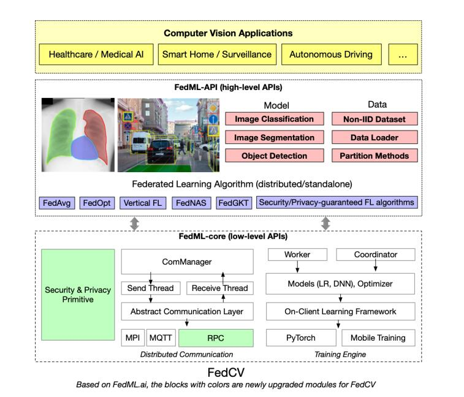

# FedCV: A Federated Learning Framework for Diverse Computer Vision Tasks

## Introduction



Federated Learning (FL) is a distributed learning paradigm that can learn a global or personalized model from decentralized datasets on edge devices. However, in the computer vision domain, model performance in FL is far behind centralized training due to the lack of exploration in diverse tasks with a unified FL framework. FL has rarely been demonstrated effectively in advanced computer vision tasks such as object detection and image segmentation. To bridge the gap and facilitate the development of FL for computer vision tasks, in this work, we propose a federated learning library and benchmarking framework, named FedCV, to evaluate FL on the three most representative computer vision tasks: image classification, image segmentation, and object detection. We provide non-I.I.D. benchmarking datasets, models, and various reference FL algorithms. Our benchmark study suggests that there are multiple challenges that deserve future exploration: centralized training tricks may not be directly applied to FL; the non-I.I.D. dataset actually downgrades the model accuracy to some degree in different tasks; improving the system efficiency of federated training is challenging given the huge number of parameters and the per-client memory cost. We believe that such a library and benchmark, along with comparable evaluation settings, is necessary to make meaningful progress in FL on computer vision tasks.

## Prerequisites & Installation

```bash
pip install fedml --upgrade
```

There are other dependencies in some tasks that need to be installed.

```bash
cd python/app/fedcv/[task_folder]
pip install -r requirements.txt
```

## FedCV Experiments

1. [Image Classification](#image-classification)

   Model:

   - DenseNet
   - MobileNetv3
   - EfficientNet

   Dataset:

   - CIFAR-10
   - CIFAR-100
   - CINIC-10
   - FedCIFAR-100
   - FederatedEMNIST
   - ImageNet
   - Landmark
   - MNIST

2. [Image Segmentation](#image-segmentation)

   Model:

   - UNet
   - DeeplabV3
   - TransUnet

   Dataset:

   - Cityscapes
   - COCO
   - PascalVOC

3. [Object Detection](#object-detection)

   Model:

   - YOLOv5

   Dataset:

   - COCO
   - COCO128

4. [Medical Chest Image Classification](#medical-chest-image-classification)

   Model:

   - DenseNet

   Dataset:

   - CheXpert
   - NIH Chest X-Ray
   - MIMIC-CXR

## How to Add Your Own Model?

Our framework supports `PyTorch` based models. To add your own specific model,

1. Create a `PyTorch` model and place it under `model` folder.
2. Prepare a `trainer module` by inheriting the base class `ClientTrainer`.
3. Prepare an experiment file similar to `torch_*.py` and shell script similar to `run_*.sh`.
4. Adjust the `fedml_config.yaml` file with the model-specific parameters.

## How to Add More Datasets, Domain-Specific Splits & Non-I.I.D.ness Generation Mechanisms?

Create new folder for your dataset under `data/` folder and provide utilities to before feeding the data to federated pre-processing utilities listed in `data/data_loader.py` based on your new dataset.

Splits and Non-I.I.D.'ness methods specific to each task are also located under `data/data_loader.py`. By default, we provide I.I.D. and non-I.I.D. sampling, Dirichlet distribution sampling based on sample size of the dataset. To create custom splitting method based on the sample size, you can create a new function or modify `load_partition_data_*` function.

## Code Structure of FedCV

- `config`: Experiment and GPU mapping configurations.

- `data`: Provide data downloading scripts and store the downloaded datasets. FedCV supports more advanced datasets and models for federated training of computer vision tasks.
- `model`: advanced CV models.
- `trainer`: please define your own trainer.py by inheriting the base class in `fedml.core.alg_frame.client_trainer.ClientTrainer `. Some tasks can share the same trainer.
- `utils`: utility functions.

You can see the README.md file in each folder for more details.

## Citation

Please cite our FedML and FedCV papers if it helps your research.

```text
@article{he2021fedcv,
  title={Fedcv: a federated learning framework for diverse computer vision tasks},
  author={He, Chaoyang and Shah, Alay Dilipbhai and Tang, Zhenheng and Sivashunmugam, Di Fan1Adarshan Naiynar and Bhogaraju, Keerti and Shimpi, Mita and Shen, Li and Chu, Xiaowen and Soltanolkotabi, Mahdi and Avestimehr, Salman},
  journal={arXiv preprint arXiv:2111.11066},
  year={2021}
}
@misc{he2020fedml,
      title={FedML: A Research Library and Benchmark for Federated Machine Learning},
      author={Chaoyang He and Songze Li and Jinhyun So and Xiao Zeng and Mi Zhang and Hongyi Wang and Xiaoyang Wang and Praneeth Vepakomma and Abhishek Singh and Hang Qiu and Xinghua Zhu and Jianzong Wang and Li Shen and Peilin Zhao and Yan Kang and Yang Liu and Ramesh Raskar and Qiang Yang and Murali Annavaram and Salman Avestimehr},
      year={2020},
      eprint={2007.13518},
      archivePrefix={arXiv},
      primaryClass={cs.LG}
}
```

## Contact

Please find contact information at the homepage.
