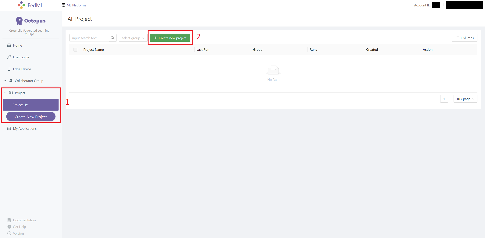
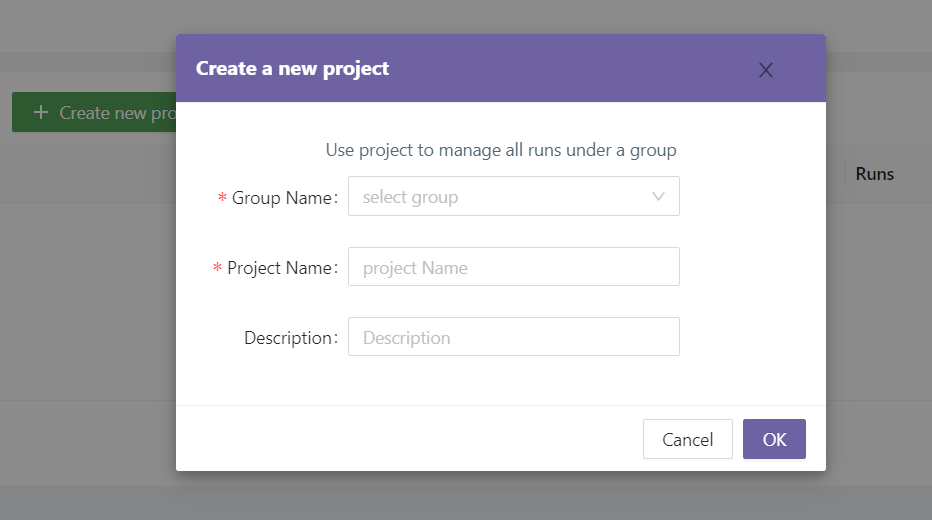
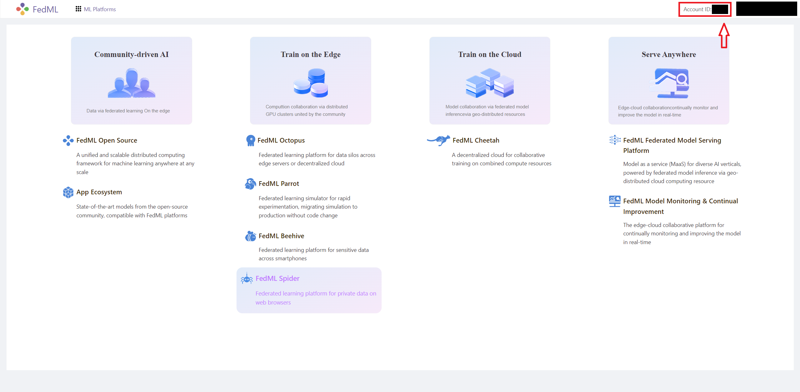
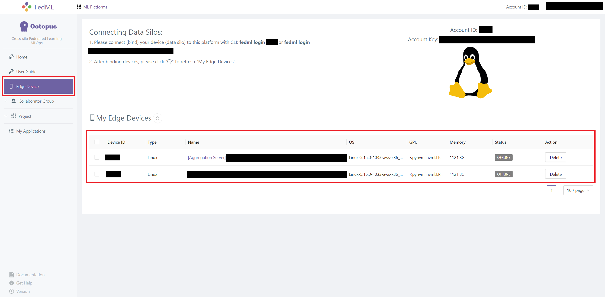
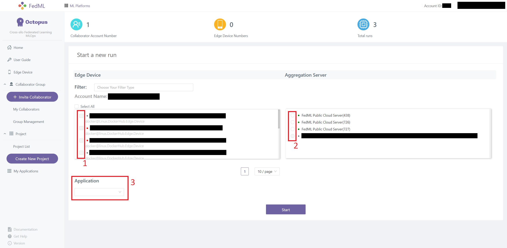
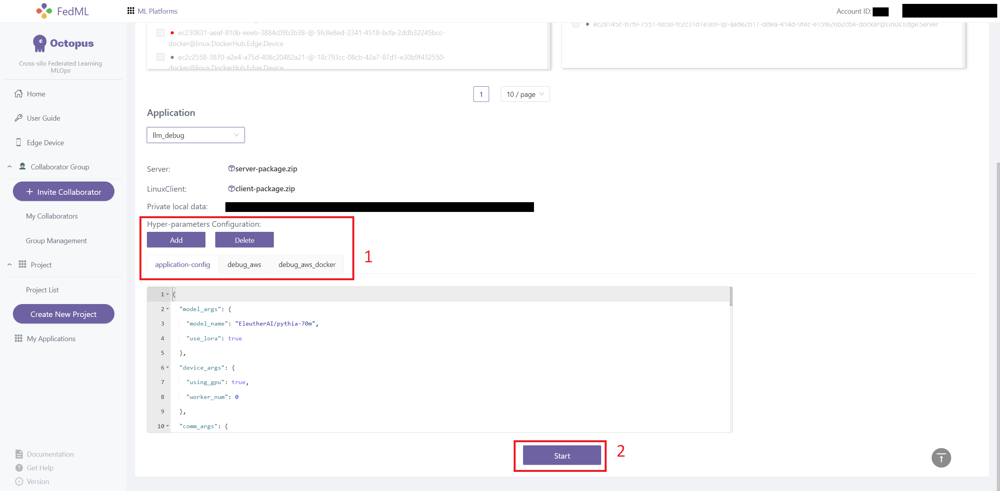

<div align="center">
 
</div>

# FedLLM: Build Your Own Large Language Models on Proprietary Data using the FedML Platform

[FedLLM](https://blog.fedml.ai/releasing-fedllm-build-your-own-large-language-models-on-proprietary-data-using-the-fedml-platform/)
is an MLOps-supported training pipeline to help users build their own large language model (LLM) on proprietary/private
data.
This repo aims to provide a minimalist example of efficient LLM training/fine-tuning
and to illustrate how to use FedML for federated LLM training and fine-tuning.

The repo contains:

- A minimalist PyTorch implementation for conventional/centralized LLM training, fine-tuning, and evaluation.
    - The training and evaluation logic
      follows [transformers.Trainer](https://huggingface.co/docs/transformers/main_classes/trainer).
    - LoRA integration from [peft](https://github.com/huggingface/peft).
    - Supports [DeepSpeed](https://www.deepspeed.ai/).
    - Dataset implementation with [datasets](https://huggingface.co/docs/datasets/index).
- Cross-silo Federated training/fine-tuning implementation with [FedML](https://github.com/FedML-AI/FedML).

## Getting Started

Clone the repo then go to FedLLM directory:

```shell
# clone the top-level repo
git clone https://github.com/FedML-AI/FedML.git

# go to the FedLLM directory
cd python/app/fedllm
```

Install dependencies with the following command:

```shell
pip install -r requirements.txt
```

See [Dependencies](#dependencies) for more information on the dependency versions.

### Prepare Dataset

Run the following command to
download [`databricks-dolly-15k`](https://github.com/databrickslabs/dolly/tree/master/data).

```shell
bash scripts/setup.sh
```

### Conventional/Centralized Training

The [`train.py`](train.py) contains a minimal example for conventional/centralized LLM training and fine-tuning
on [`databricks-dolly-15k`](https://github.com/databrickslabs/dolly/tree/master/data) dataset.

Example scripts:

```shell
# train on a single GPU
bash scripts/train.sh \
  ... # additional arguments

# train with PyTorch DDP
bash scripts/train_ddp.sh \
  ... # additional arguments

# train with DeepSpeed
bash scripts/train_deepspeed.sh \
  ... # additional arguments
```

**_Tips_**: if you have an Amper or newer GPU (e.g., RTX 3000 or newer), you could turn on **bf16** to have more
efficient training by passing
`--bf16 "True"` in the command line.

**_Notice_**: when using PyTorch DDP with LoRA and gradient checkpointing,
you need to turn off `find_unused_parameters`
by passing `--ddp_find_unused_parameters "False"` in the command line.

### Cross-silo Federated Learning

#### 1. Install FedML

Install FedML with the following command

```shell
pip install fedml
```

#### 2. Run FedML

To train/fine-tune in federated setting, you need to provide a FedML config file.
An example can be found in [fedml_config/fedml_config.yaml](fedml_config/fedml_config.yaml).
To launch an experiment, a `RUN_ID` should be provided. For each experiment, the same `RUN_ID` should be used across all
the client(s) and aggregator server.

**_Notice_**: since we use `RUN_ID` to uniquely identify experiments,
we recommend that you carefully choose the `RUN_ID`.
You may also generate a UUID for your `RUN_ID` with built-in Python module `uuid`;
e.g. use `RUN_ID="$(python3 -c "import uuid; print(uuid.uuid4().hex)")"` in your shell script.

Example scripts:

```shell
# run aggregator server
bash scripts/run_fedml_server.sh "$RUN_ID"

# run client(s)
for client_rank in "${client_ranks}"; do
  bash scripts/run_fedml_client.sh "$client_rank" "$RUN_ID" &
done
```

_See FedML's [Getting Started](https://doc.fedml.ai/starter/getting_started.html) for detail._

### Use FedML Octopus (MLOps) for Model Training

FedML Octopus is a MLOps platform that simplifies model training and deployment.

_See [FedML MLOps User Guide](https://doc.fedml.ai/mlops/user_guide.html) for detail._

#### 1. Login or Signup for FedML Account

_Skip this step if you already have a FedML account._

1. Go to [FedML official website](https://open.fedml.ai/login).
2. Go to **Sign Up** and sign up for an account (skip this step if you already have an account).
3. Click **login** to login to your account.

#### 2. Build package

Use the following command to build client and aggregator server package for MLOps.

```shell
fedml build -t $TARGET_TYPE -sf $SOURCE -ep $ENTRY -cf $CONFIG -df $DEST
```

> Usage: fedml build [OPTIONS]
>
> Commands for open.fedml.ai MLOps platform
>
> Options:
>
>   - `-t`, --type TEXT client or aggregator server? (value: client; server)
>
>   - `-sf`, --source_folder TEXT the source code folder path
>
>   - `-ep`, --entry_point TEXT the entry point (a .py file) of the source code
>
>   - `-cf`, --config_folder TEXT the config folder path
>
>   - `-df`, --dest_folder TEXT the destination package folder path
>
>   - `--help`, Show this message and exit.


To compile an example package, use the following command in the **FedLLM root directory**:

```shell
# build aggregator server package
fedml build -t server -sf . -ep main_mlops.py -df build -cf "mlops_config" -ig "build"

# build client package
fedml build -t client -sf . -ep main_mlops.py -df build -cf "mlops_config" -ig "build"
```

#### 2. Create an Octopus Application

1. Once logged in, go to [FedML Octopus](https://open.fedml.ai/octopus/userGuides/index).
   

2. Go to [My Applications](https://open.fedml.ai/octopus/applications/index), then click `+ New Application` to
   create a new application.
   

3. Enter `Application name` and upload `Server` and `Client` packages.
   
   If you followed the tutorial, the packages should be located at `build/dist-packages`.
   

#### 3. Create an Octopus Project

1. Navigate to [Project](https://open.fedml.ai/octopus/project/index) page and click `+ Create new project`.
   

2. Enter `Group` and select a project group from `Group Name` dropdown menu; there should a default group available.
   

#### 4. Login from Your Device(s)

1. Find your account ID from the top-right corner of the page.
   

2. On your device, login as a client with command `fedml login $account_id`.

3. On your device (preferably a different physical device), login as a aggregator server with
   command `fedml login -s $account_id`.

4. You should be able to find your devices in [Edge Devices](https://open.fedml.ai/octopus/edgeDevice/edgeApp) page
   

5. In the [Project](https://open.fedml.ai/octopus/project/index) page, select the project you just created.
   

#### 5. Start Training

1. Select `+ Create new run` to create a new experiment.
   

2. Select your **client** and **aggregator server** devices and select **application** from the `Application` dropdown
   menu.
   

3. Select and existing Hyper-parameter Configuration. You can also `Add` and `Delete` configurations.

4. Click `Start` to start your experiment.
   

### Experiment Tracking and More with FedML Octopus

You can easily monitor system performance,and visualize training/evaluation metrics with FedML Octopus.


**Congratulations! You've completed the FedLLM tutorial on FedML!!!**

Check out [FedML Octopus](https://open.fedml.ai/octopus/index) and our [Video Tutorial](https://youtu.be/Xgm0XEaMlVQ)
for detail.

### Dependencies

We have tested our implement with the following setup:

- Ubuntu `20.04.5 LTS`
- CUDA `11.8`, `11.7` and `11.6`
- Python `3.8.13`
    - `fedml>=0.8.4a7,<=0.8.4a17`
    - `torch==0.2.0`
    - `torchvision==0.15.1`
    - `transformers==4.28.1`
    - `peft==0.3.0`
    - `datasets==2.11.0`
    - `deepspeed==0.9.1`
    - `numpy==1.24.3`
    - `tensorboard==2.12.2`
    - `mpi4py==3.1.4`
