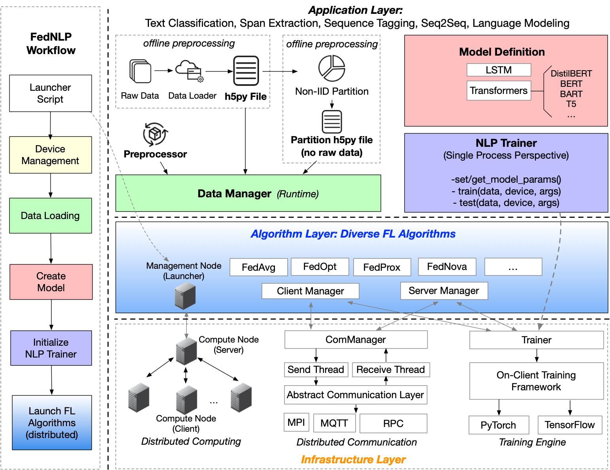

# FedNLP: A Research Platform for Federated Learning in Natural Language Processing

<!-- This is FedNLP, an application ecosystem for federated natural language processing based on FedML framework (https://github.com/FedML-AI/FedML). -->

FedNLP is a research-oriented benchmarking framework for advancing *federated learning* (FL) in *natural language processing* (NLP). It uses the FedML API in its backend for for various Federated algorithms like FedAvg and FedOpt and platforms (Distributed Computing, IoT/Mobile, Standalone).

The figure below is the overall structure of FedNLP.


## Installation
After `git clone`-ing this repository, please run the following command to install our dependencies.

```bash
sudo apt install libopenmpi-dev
pip install mpi4py
cd FedML/python/app/fednlp
conda create -n fednlp python=3.8
pip install fedml
pip install -r requirements.txt
```
## Code Structure of FedNLP

- `data`: provide data downloading scripts and raw data loader to process original data and generate h5py files. Besides, `data/advanced_partition` offers some practical partition functions to split data for each client.

- `{application_name}/`: Each folder contains the required trainers, data_loaders and configs for running the examples.


## How to run the examples

We provide 4 different NLP applications namely Text Classification, Sequence Tagging, Span Extraction and Sequence2Sequence. We provide examples for each application and also provide steps on how to run each application below. We have provided download scripts for 12 different datasets across these 4 applications.

For each of these make sure the datapaths and the gpu config paths are given correctly in the `fedml_config.yaml` file and also make sure the number of clients per round and number of workers match

**TEXT CLASSIFICATION**

Read `data/README.md` for more details of datasets available

Adjust the hyperparameters in `text_classificationconfig/fedml_config_mpi.yaml`

To run text classification using MPI simulator follow the following steps:

```bash
1. cd text_classification/
2. bash ../data/download_data.sh
3. bash ../data/download_partition.sh
4. bash run_mpi_simulation.sh 5
```

**SEQ TAGGING**

Read `data/README.md` for more details of datasets available

Adjust the hyperparameters in `seq_tagging/config/fedml_config_mpi.yaml`

To run sequence tagging on wikiner dataset using MPI simulator follow the following steps:

```bash
1. cd seq_tagging/
2. bash ../data/download_data.sh
3. bash ../data/download_partition.sh
4. bash run_mpi_simulation.sh 5
```

**SPAN EXTRACTION**

Adjust the hyperparameters in `span_extraction/config/fedml_config.yaml` and make sure data file paths are correct

To run span extraction on MRQA dataset using MPI simulator follow the following steps:

```bash
1. cd span_extraction/
2. bash ../data/download_data.sh
3. bash ../data/download_partition.sh
4. bash run_mpi_simulation.sh 4
```


**SEQ2SEQ**

Read `data/README.md` for more details of datasets available

Adjust the hyperparameters in `seq2seq/config/fedml_config.yaml` and make sure data file paths are correct

To run seq2seq using MPI simulator on cornell_movie_dialogue dataset follow the following steps:

```bash
1. cd seq2seq/
2. bash ../data/download_data.sh
3. bash ../data/download_partition.sh
4. bash run_mpi_simulation.sh 1
```

We have provided examples of trainers in each example. For running custom trainers feel free to follow the folder `{application_name}/trainer/` and write your own custom trainer. To include this trainer please follow the create_model function in the python executable in the folder `{application_name}/` and replace the current trainer with your own trainer. Every trainer should inherit the Client Trainer class and should contain a train and a test function.


We have provided examples with BERT and DistilBert for text classification, seq tagging and span extraction and BART for Seq2Seq. For using any other model from Huggingface Transformers please look at the create_model function in the python executable in the folder `{application_name}/`. Also please ensure that you are using the correct tokenizer in `{application_name}/data/data_loader.py` 


* Here {application_name} refers to any one of text_classification, span_extraction, seq_tagging or seq2seq.
