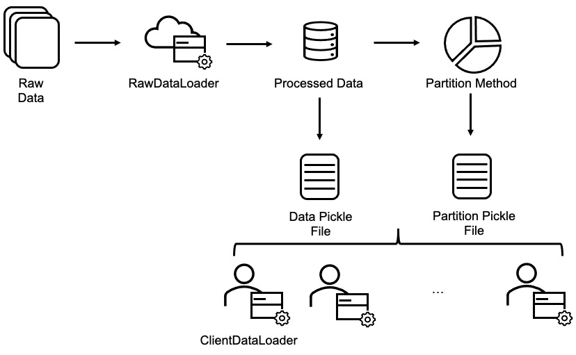

## DataLoader

In fednlp, we design two kinds of data loaders for users to load the dataset since some users care about data formats,
data distribution and data features but others are not.

### RawDataLoader
RawDataLoader load and process dataset from scratch. Users can specify the dataset path in constructor and call the 
data_loader function to load the data. The return format will be a dictionary which contains raw data and data attributes.
Users can exploit the data attributes or data itself for further partition.

### ClientDataLoader
For those users who do not care about raw data, we pre-generate a data pickle file and a partition pickle file for each 
dataset. In this case, users can utilize ClientDataLoader to load the entire data or partitioned data by assigning client_idx
with reasonable value in constructor. Also, users can specify the partition method in order to obtaining data with 
different partition. For more details, please checkout the code directly.

The figure below illustrates the workflow.

### Test
You can try the following commands and checkout /test/test_all_rawdataloader.sh as well as test_dataloader.py for more
details. You need to have the necessary datasets downloaded using download scripts in the ../download_scripts folder
