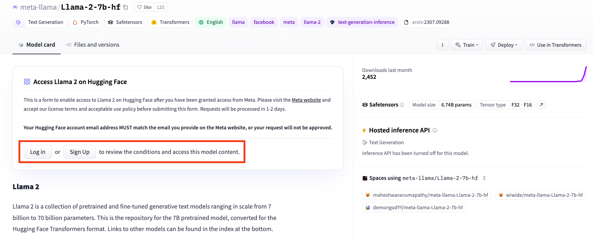

<div align="center">
 
</div>

# LLM Fine-tune

This repo contains an MLOps-supported training pipeline to help users build their own large language model (LLM) on proprietary/private
data.
This repo aims to provide a minimalist example of efficient LLM training/fine-tuning
and to illustrate how to use FedML Launch and fine-tuning.
We leverage Pythia 7B by default and recently added support for Llama 2.

The repo contains:

- A minimalist PyTorch implementation for conventional/centralized LLM training, fine-tuning, and evaluation.
    - The training and evaluation logic follows [transformers.Trainer](https://huggingface.co/docs/transformers/main_classes/trainer).
    - LoRA integration from [peft](https://github.com/huggingface/peft).
    - Supports [DeepSpeed](https://www.deepspeed.ai/).
    - Dataset implementation with [datasets](https://huggingface.co/docs/datasets/index).

## How to Use Llama 2

Our example uses Pythia by default, but we recently added support for Llama2.
If you'd like to use Llama2, please see the following instructions before getting started.

To use [Llama 2](https://ai.meta.com/llama/), you need to apply access from Meta and request Meta's private
Hugging Face repo access.

1. Make sure your `transformers` version is `4.31.0` or newer. You could update your transformers via
   `pip install --upgrade transformers`.
2. Please visit the [Meta website](https://ai.meta.com/resources/models-and-libraries/llama-downloads/) and apply for
   access.
3. Apply for [Meta's private repo](https://huggingface.co/meta-llama/Llama-2-7b-hf)
   on [Hugging Face](https://huggingface.co/meta-llama/Llama-2-7b-hf). See below image for detail.
   
4. Once both access are granted, you can start using Llama by passing `--model_name "meta-llama/Llama-2-7b-hf"` to the training script.

> **Warning**
> Since Llama 2 is on a private Hugging Face repo, you need to either login to Hugging Face or provide your access token.
> - To login to huggingface (see https://huggingface.co/settings/tokens for detail), run `huggingface-cli login` in
    command line.
> - To pass an access token, you need to do one of the following:
>   - Set environment variable `HUGGING_FACE_HUB_TOKEN="<your access token>"`
>   - For centralized/conventional training, pass `--auth_token "<your access token>"` in the command line.

## Getting Started

Clone the repo then go to the project directory:

```shell
# clone the repo
git clone https://github.com/FedML-AI/llm-finetune.git

# go to the project directory
cd llm-finetune
```

Install dependencies with the following command:

```shell
pip install -r requirements.txt
```

See [Dependencies](#dependencies) for more information on the dependency versions.

### Conventional/Centralized Training

The [`run_train.py`](run_train.py) contains a minimal example for conventional/centralized LLM training and fine-tuning
on [`databricks-dolly-15k`](https://huggingface.co/datasets/FedML/databricks-dolly-15k-niid) dataset.

Example scripts:

```shell
# train on a single GPU
bash scripts/train.sh \
  ... # additional arguments

# train with PyTorch DDP
bash scripts/train_ddp.sh \
  ... # additional arguments

# train with DeepSpeed
bash scripts/train_deepspeed.sh \
  ... # additional arguments
```

> **Note**
> If you have an Amper or newer GPU (e.g., RTX 3000 series or newer), you could turn on **bf16** to have more
> efficient training by passing `--bf16 "True"` in the command line.

> **Warning**
> when using PyTorch DDP with LoRA and gradient checkpointing, you need to turn off `find_unused_parameters`
> by passing `--ddp_find_unused_parameters "False"` in the command line.

### Dependencies

We have tested our implement with the following setup:

- Ubuntu `20.04.5 LTS` and `22.04.2 LTS`
- CUDA `12.2`, `11.8`, `11.7` and `11.6`
- Python `3.8.13` and `3.9.16`
    - `fedml>=0.8.4a7`
    - `torch>=2.0.0,<=2.1.0`
    - `torchvision>=0.15.1,<=0.16.0`
    - `transformers>=4.31.0,<=4.34.0`
    - `peft>=0.4.0,<=0.5.0`
    - `datasets>=2.11.0,<=2.14.5`
    - `deepspeed>=0.9.1,<=0.10.3`
    - `numpy>=1.24.3,<=1.24.4`
    - `tensorboard>=2.12.2,<=2.13.0`
    - `mpi4py>=3.1.4,<=3.1.5`
