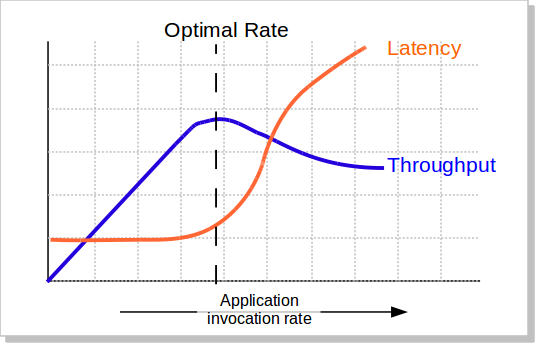

# Autoscaler
An independent service for automated scaling of resources depending on incoming traffic.

# Background
Some useful background for the different metrics used by the autoscaler service.

- ***Throughout or QPS (queries-per-second)*** is measured as the number of requests the system can handle per unit of time (elapsed/cost); unit of time could be seconds/minutes/hours. For instance, given a total number of issued requests over a total elapsed time in seconds:
    ```
    throughout or qps = #total_requests / #total_time_sec
    example 1: #total_requests = 1 and #total_time_sec = 10sec
      qps = 1/10 = 0.1 queries-per-second
    example 2: #total_requests = 100 and #total_time_sec = 60sec
      qps = 100/60 = 1.66 queries-per-second
    ```

- ***Response Time (RT)*** is the end-to-end time or round-trip time. That is, the total time it takes for an end user to receive a reply to a submitted request. For instance, in a Web Application with a Backend platform, Response Time will represent the time it takes to perform a round-trip similar to the following:

```UI Request -> Web App -> Backend -> Web App -> UI Reply```

- ***Latency*** is a more fine-grained metric and has a more precise and narrow definition compared to Response Time. System latency is measured as the time it takes for a system to handle k operations/requests.

```
For instance if a backend system handles 200 requests within 300 seconds, then its latency is:
      latency = 300 / 200 = 1.5 seconds-per-request
```



# Test (Standalone)
To run the test scripts you need to go into the `test/` directory and then execute `python test/autoscaler_stress_test.py`.