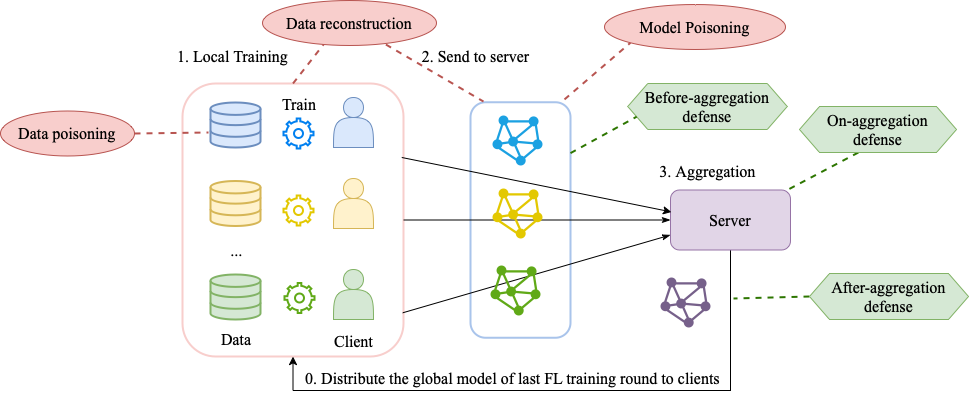

This library implements the following attacks and defenses.

# Attack
1. ByzantineAttack: (1) zero mode (2) random mode (3) flip mode
2. (NeurIPS 2019) DLGAttack: "Deep leakage from gradients" 
https://proceedings.neurips.cc/paper/2019/file/60a6c4002cc7b29142def8871531281a-Paper.pdf
3. (NeurIPS 2020) InvertAttack: "Inverting gradients-how easy is it to break privacy in federated learning?"
https://github.com/JonasGeiping/invertinggradients/
4. LabelFlippingAttack: "Data Poisoning Attacks Against Federated Learning Systems" 
https://arxiv.org/pdf/2007.08432
5. (NeurIPS 2021) RevealingLabelsFromGradientsAttack: "Revealing and Protecting Labels in Distributed Training" 
https://proceedings.neurips.cc/paper/2021/file/0d924f0e6b3fd0d91074c22727a53966-Paper.pdf
6. (NeurIPS 2019) BackdoorAttack: "A Little Is Enough: Circumventing Defenses For Distributed Learning" 
https://proceedings.neurips.cc/paper/2019/file/ec1c59141046cd1866bbbcdfb6ae31d4-Paper.pdf
7. (NeurIPS 2020) EdgeCaseBackdoorAttack: "Attack of the Tails: Yes, You Really Can Backdoor Federated Learning" 
https://proceedings.neurips.cc/paper/2020/file/b8ffa41d4e492f0fad2f13e29e1762eb-Paper.pdf
8. (PMLR'20) ModelReplacementBackdoorAttack: "How To Backdoor Federated Learning" 
http://proceedings.mlr.press/v108/bagdasaryan20a/bagdasaryan20a.pdf


# Defense
1. (PMLR 2018) BulyanDefense: "The Hidden Vulnerability of Distributed Learning in Byzantium. "
http://proceedings.mlr.press/v80/mhamdi18a/mhamdi18a.pdf
2. CClipDefense: "Byzantine-Robust Learning on Heterogeneous Datasets via Bucketing"
https://arxiv.org/pdf/2006.09365.pdf
3. GeometricMedianDefense: "Distributed statistical machine learning in adversarial settings: Byzantine gradient descent. "
https://dl.acm.org/doi/pdf/10.1145/3154503
4. (NeurIPS 2017) KrumDefense: "Machine Learning with Adversaries: Byzantine Tolerant Gradient Descent"
https://papers.nips.cc/paper/2017/file/f4b9ec30ad9f68f89b29639786cb62ef-Paper.pdf
5. (ICLR 2021) MultiKrumDefense: "Distributed momentum for byzantine-resilient stochastic gradient descent"
https://infoscience.epfl.ch/record/287261
6. NormDiffClippingDefense: "Can You Really Backdoor Federated Learning?" 
https://arxiv.org/pdf/1911.07963.pdf 
7. (AAAI 2021) RobustLearningRateDefense: "Defending against backdoors in federated learning with robust learning rate."
https://github.com/TinfoilHat0/Defending-Against-Backdoors-with-Robust-Learning-Rate
8. SoteriaDefense: "Provable defense against privacy leakage in federated learning from representation perspective." 
https://arxiv.org/pdf/2012.06043
9. SLSGDDefense: "SLSGD: Secure and efficient distributed on-device machine learning"
https://arxiv.org/pdf/1903.06996.pdf
10. RFA_defense: "Robust Aggregation for Federated Learning"
https://arxiv.org/pdf/1912.13445
11. (USENIX2020) FoolsGoldDefense: "The Limitations of Federated Learning in Sybil Settings"
https://www.usenix.org/system/files/raid20-fung.pdf
12. (ICML 2018) CoordinateWiseMedianDefense: "Byzantine-Robust Distributed Learning: Towards Optimal Statistical Rates"
http://proceedings.mlr.press/v80/yin18a/yin18a.pdf
13. (NeurIPS 2021) WbcDefense: "Enhancing Robustness against Model Poisoning Attacks in Federated Learning from a Client Perspective" 
https://arxiv.org/abs/2110.13864
14. (ICML 2021) CRFLDefense: "CRFL: Certifiably Robust Federated Learning against Backdoor Attacks"
http://proceedings.mlr.press/v139/xie21a/xie21a.pdf


The overview of the injections of attacks and defenses are as follows.


For example configurations of each attack and defense mechanism, please refer to [FedMLSecurity_example](https://github.com/FedML-AI/FedML/tree/master/python/examples/security/fedMLSecurity_experiments)

For details of the library, please refer to the following paper: [FedMLSecurity_Paper](https://arxiv.org/pdf/2306.04959)

For customization of dataloader, please refer to [Data_Loader_Customization](https://github.com/FedML-AI/FedML/blob/master/doc/en/simulation/user_guide/data_loader_customization.md)

For details of supported datasets and models, please refer to [Dataset_and_Models](https://github.com/FedML-AI/FedML/blob/master/doc/en/simulation/user_guide/datasets-and-models.md) and [Data_Repo](https://github.com/FedML-AI/FedML/tree/master/python/fedml/data)

Citation:
```
@article{han2023fedmlsecurity,
  title={FedMLSecurity: A Benchmark for Attacks and Defenses in Federated Learning and LLMs},
  author={Han, Shanshan and Buyukates, Baturalp and Hu, Zijian and Jin, Han and Jin, Weizhao and Sun, Lichao and Wang, Xiaoyang and Xie, Chulin and Zhang, Kai and Zhang, Qifan and others},
  journal={arXiv preprint arXiv:2306.04959},
  year={2023}
}

```

