<div align="center">
 
</div>

# UnitedLLM: Training and Serving LLM Collaboratively on Decentralized GPU Clouds

[FEDML® UnitedLLM](https://blog.fedml.ai/releasing-fedllm-build-your-own-large-language-models-on-proprietary-data-using-the-fedml-platform/)
is an MLOps-supported training pipeline for decentralized pretraining and finetuning of large language models.

## Getting Started

Clone the repo then go to UnitedLLM directory:

```shell
# clone the repo and the submodules
git clone https://github.com/FedML-AI/FedML.git -b unitedllm

# go to the project directory
cd python/spotlight_prj/unitedllm

# Install dependencies
pip install -r requirements.txt

# Update the repo
git pull

# Download the example datasets.
bash scripts/setup.sh
```

### Conventional/Centralized Training

See [LLM Train examples](https://github.com/FedML-AI/FedML/tree/master/python/examples/train/llm_train) for details.

### Decentralized Cross-cloud Training with FedML

#### 1. Install FedML

Install FedML with the following command

```shell
pip install fedml
```

#### 2. Prepare a Configuration File

To train/fine-tune in decentralized setting, you need to provide a FedML config file.
A concrete example can be found in [fedml_config/fedml_config.yaml](fedml_config/fedml_config.yaml).

```yaml
common_args:
  training_type: "cross_cloud"  # decentralized training type, we recommend `cross_cloud` for LLMs
  scenario: "horizontal"  # decentralized training scenario, we recommend `horizontal` for LLMs
  use_customized_hierarchical: True  # if `True`, will use customized hierarchical cross-cloud; this could improve the training stability
  random_seed: 0

environment_args:
  bootstrap: fedml_config/bootstrap.sh  # change to "config/bootstrap.sh" when using MLOps
  launcher: "auto"  # program launcher, choose from `auto`, `torch`, `deepspeed`

data_args:
  dataset: "databricks-dolly"  # dataset name; this setting is required for FedML built-in datasets
  dataset_name: "fedml/databricks-dolly-15k-niid"
  dataset_path: [ ]
  client_dataset_path: [ ]
  test_dataset_size: 200  # this is ignored when `dataset_path` has more than 1 element
  remove_long_seq: True  # if `True` remove all data whose sequence length > max_seq_length
  truncate_long_seq: True  # if `True` truncate long sequences whose length > max_seq_length

model_args:
  skip_log_model_net: True  # toggle auto model input shape inference; if set to `False`, could slow down the training
  model_name_or_path: "EleutherAI/pythia-70m"  # choose any decoder-only hugging face model
  # need to install `flash_attn` package first, see https://github.com/Dao-AILab/flash-attention for detail
  use_flash_attention: False
  load_pretrained: False  # Whether to load pretrained weights
  # PEFT configs
  peft_type: "lora"

train_args:
  federated_optimizer: "FedAvg"
  client_optimizer: "adamw_torch"
  server_optimizer: "FedAvg"
  client_num_in_total: 2  # number of clients
  client_num_per_round: 2  # choose from 1~client_num_in_total
  comm_round: 5  # number of rounds of aggregation
  # below are the same as HuggingFace settings
  deepspeed: "configs/deepspeed/ds_z3_bf16_config.json"
  ddp_find_unused_parameters: False
  seed: 1234
  fp16: False
  bf16: False
  gradient_checkpointing: True
  per_device_train_batch_size: 8
  per_device_eval_batch_size: 8
  gradient_accumulation_steps: 1
  eval_accumulation_steps: 4
  learning_rate: 3.0e-4
  warmup_steps: 50
  output_dir: ".logs/UnitedLLM/{run_id}"
  logging_steps: 20
  eval_steps: 200
  save_steps: 200
  save_total_limit: 10
  logging_strategy: "no"
  evaluation_strategy: "no"  # should be turned off
  save_strategy: "no"
  save_on_each_node: True
  # extra options
  # model weights type.
  model_dtype: "fp32"  # choose from "bf16" | "fp16" | "fp32"
  # number of training epoch for each communication round, total epoch is local_num_train_epochs * comm_round
  local_num_train_epochs: 1
  # number of training steps for each communication round, total step is local_max_steps * comm_round;
  #   this option overwrites `local_num_train_epochs`; set to a non-positive value to disable it.
  local_max_steps: 200

validation_args:
  frequency_of_the_test: 1
  test_on_clients: "after_aggregation"  # choose from "before_aggregation" | "after_aggregation" | "no" | "both"
  is_aggregator_test: False  # set to `True` to enable testing on aggregator after each aggregation
  test_on_client_ranks: [ 1 ]  # the rank of the clients to run test
  # Number of updates steps before two checkpoint saves. Set to 0 to disable saving. Set to a negative number or
  # null to save after every test (i.e. same as `frequency_of_the_test`).
  save_frequency: null

device_args:
  using_gpu: True

comm_args:
  backend: "MQTT_S3"
  is_mobile: 0

tracking_args:
  enable_wandb: False
  wandb_only_server: True

```

#### 3. Run FedML

To launch an experiment, a `RUN_ID` should be provided. For each experiment, the same `RUN_ID` should
be used across all the client(s) and aggregator server.
For clients, `client_rank` is also required. Each client should have a unique `client_rank` and
the value should be in range from 1 to N where N is the number of clients.
`client_rank` is the distributed rank which is similar to an index in an array; each client can be
"indexed" by its rank.


> **Note**
> since we use `RUN_ID` to uniquely identify experiments, we recommend that you carefully choose the `RUN_ID`.
> You may also generate a UUID for your `RUN_ID` with built-in Python module `uuid`; 
> e.g. use `RUN_ID="$(python3 -c "import uuid; print(uuid.uuid4().hex)")"` in your shell script.

Example scripts:

```shell
# run aggregator server
bash scripts/run_fedml_server.sh "$RUN_ID"

# run client(s)
bash scripts/run_fedml_client.sh 1 "$RUN_ID"
bash scripts/run_fedml_client.sh 2 "$RUN_ID"
bash scripts/run_fedml_client.sh 3 "$RUN_ID"
...
```

_See FedML's [Getting Started](https://doc.fedml.ai/federate/getting_started) for details._

### Use FedML Octopus (MLOps) for Model Training

FedML Octopus is a MLOps platform that simplifies model training and deployment.

We strongly recommend going through our [step-by-step introduction to Octopus](https://blog.fedml.ai/fedml-octopus-getting-started-federated-machine-learning/).

#### 1. Login or Signup for FedML Account

_Skip this step if you already have a FedML account._

1. Go to [FedML official website](https://open.fedml.ai/login).
2. Go to **Sign Up** and sign up for an account (skip this step if you already have an account).
3. Click **login** to login to your account.

#### 2. Build package

Use the following command to build client and aggregator server package for MLOps.

```shell
fedml build -t $TARGET_TYPE -sf $SOURCE -ep $ENTRY -cf $CONFIG -df $DEST
```

> Usage: fedml build [OPTIONS]
>
> Commands for open.fedml.ai MLOps platform
>
> Options:
>
>   - `-t`, --type TEXT client or aggregator server? (value: client; server)
>
>   - `-sf`, --source_folder TEXT the source code folder path
>
>   - `-ep`, --entry_point TEXT the entry point (a .py file) of the source code
>
>   - `-cf`, --config_folder TEXT the config folder path
>
>   - `-df`, --dest_folder TEXT the destination package folder path
>
>   - `--help`, Show this message and exit.


To compile an example package, use the following command in the **UnitedLLM root directory**:

```shell
# build aggregator server package
fedml build -t server -sf . -ep launch_fedllm.py -df build -cf "mlops_config" -ig "build"

# build client package
fedml build -t client -sf . -ep launch_fedllm.py -df build -cf "mlops_config" -ig "build"
```

We also provide an example script for building the packages:
```shell
bash scripts/build/fedml_build.sh
```

#### 2. Create an Octopus Application

1. Once logged in, go to [FedML Octopus](https://open.fedml.ai/octopus/userGuides/index).
   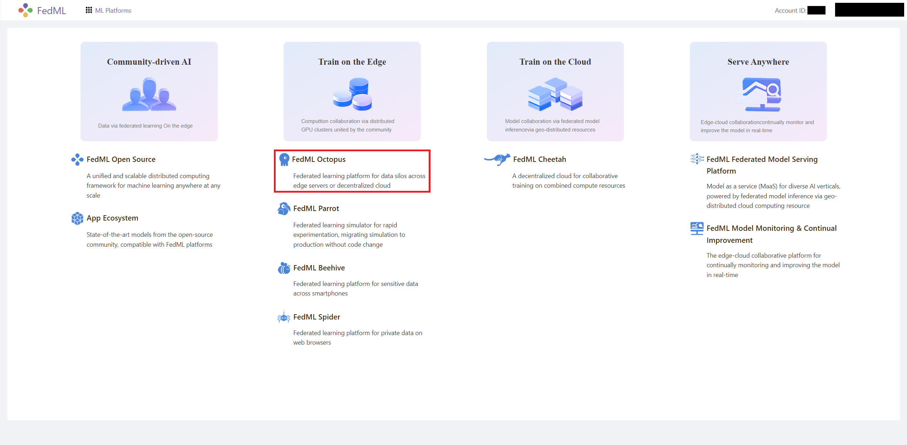

2. Go to [My Applications](https://open.fedml.ai/octopus/applications/index), then click `+ New Application` to
   create a new application.
   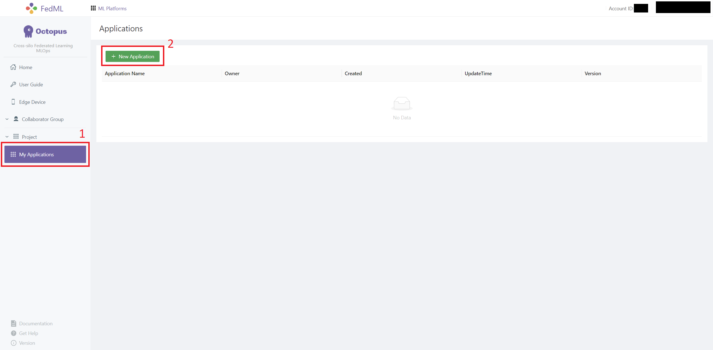

3. Enter `Application name` and upload `Server` and `Client` packages.
   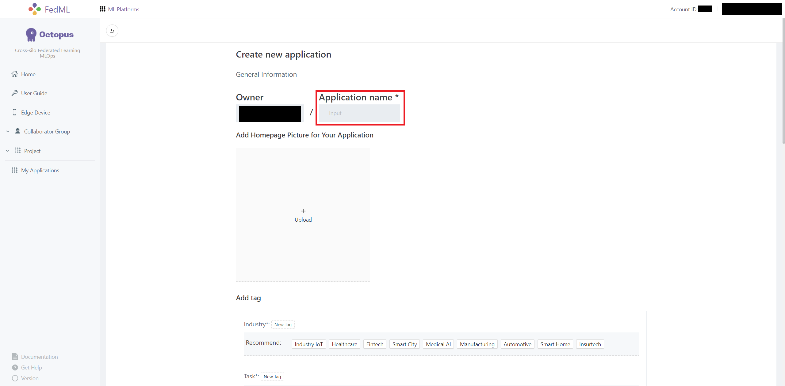
   If you followed the tutorial, the packages should be located at `build/dist-packages`.
   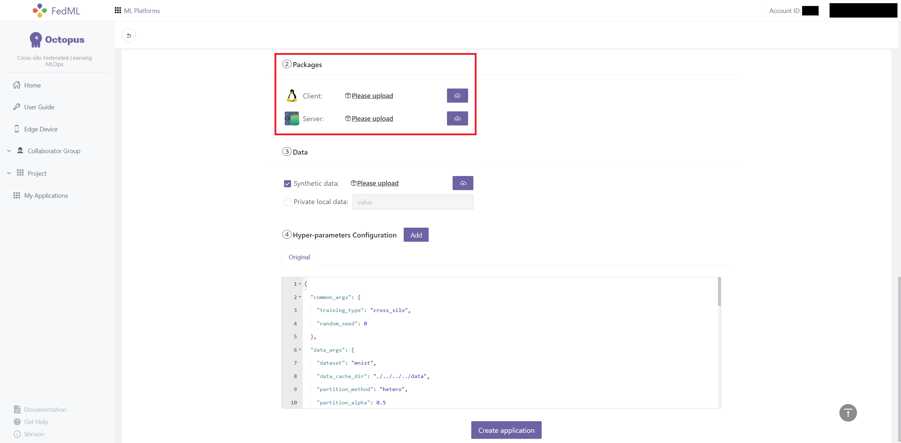

#### 3. Create an Octopus Project

1. Navigate to [Project](https://open.fedml.ai/octopus/project/index) page and click `+ Create new project`.
   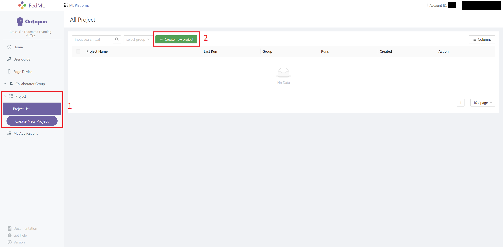

2. Enter `Group` and select a project group from `Group Name` dropdown menu; there should a default group available.
   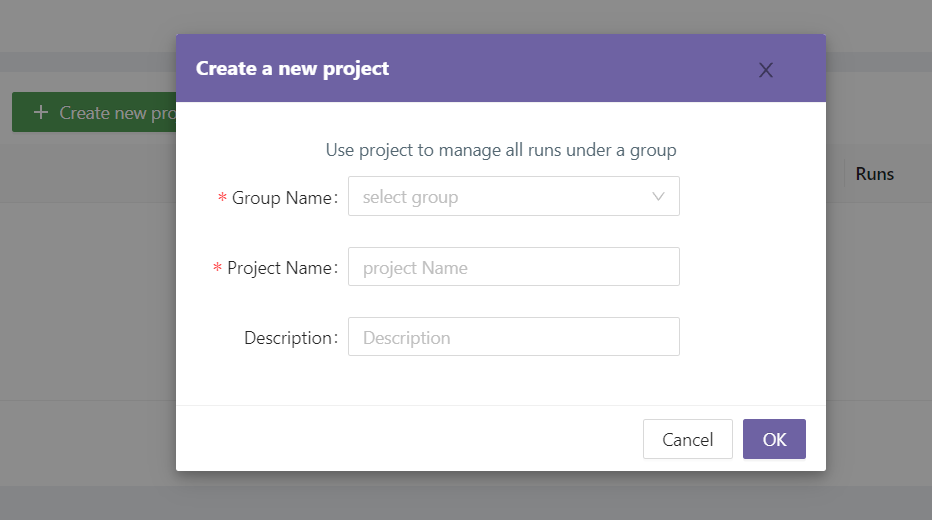

#### 4. Login from Your Device(s)

1. Find your account ID from the top-right corner of the page.
   

2. On your device, login as a client with command `fedml login $account_id`.

3. On your device (preferably a different physical device), login as a aggregator server with
   command `fedml login -s $account_id`.

4. You should be able to find your devices in [Edge Devices](https://open.fedml.ai/octopus/edgeDevice/edgeApp) page
   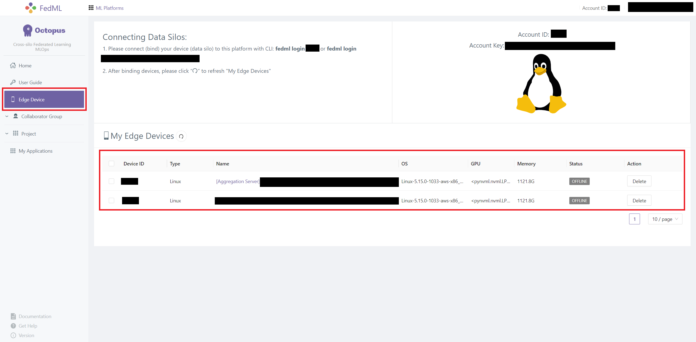

5. In the [Project](https://open.fedml.ai/octopus/project/index) page, select the project you just created.
   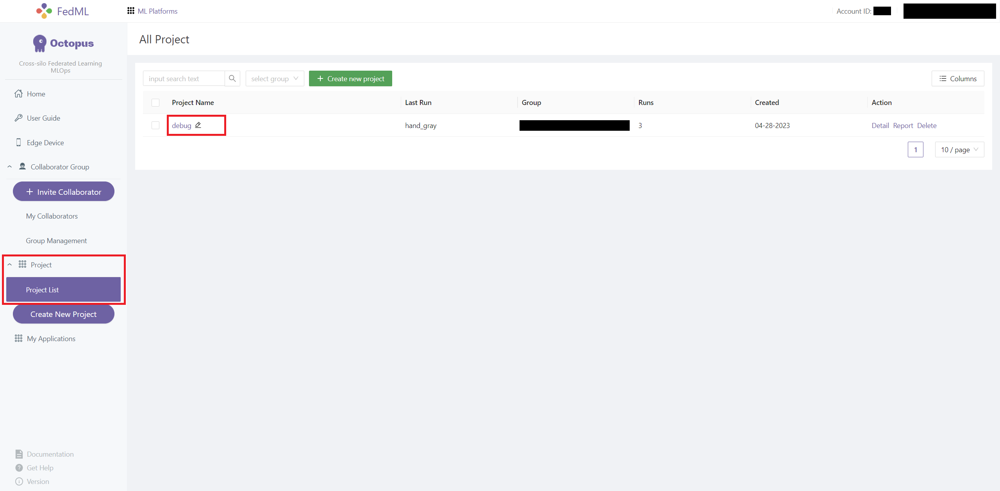

#### 5. Start Training

1. Select `+ Create new run` to create a new experiment.
   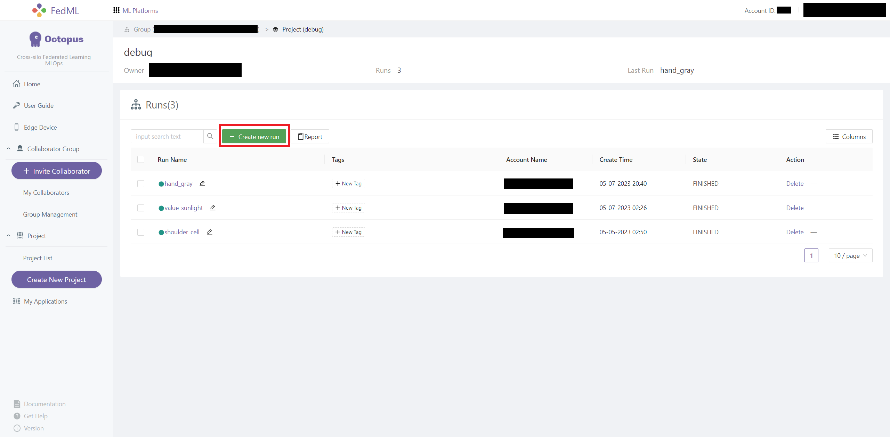

2. Select your **client** and **aggregator server** devices and select **application** from the `Application` dropdown
   menu.
   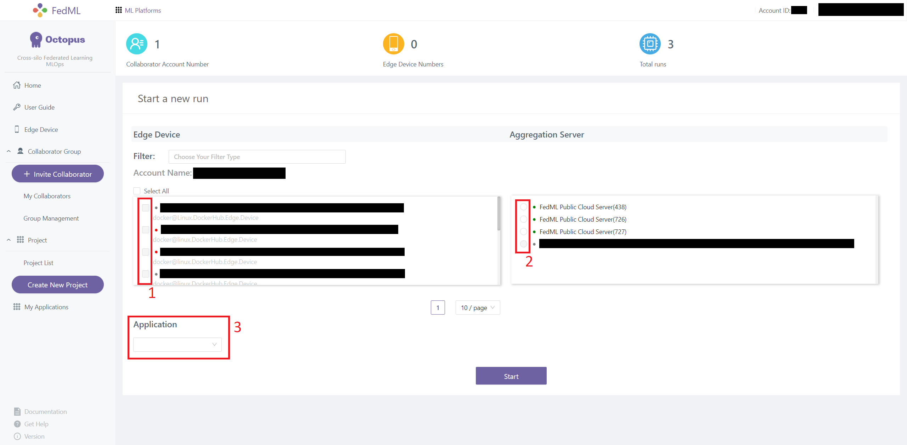

3. Select and existing Hyper-parameter Configuration. You can also `Add` and `Delete` configurations.

4. Click `Start` to start your experiment.
   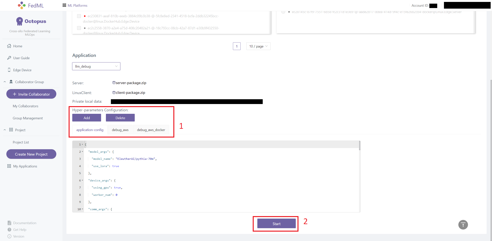

### Experiment Tracking and More with FedML Octopus

You can easily monitor system performance,and visualize training/evaluation metrics with FedML Octopus.

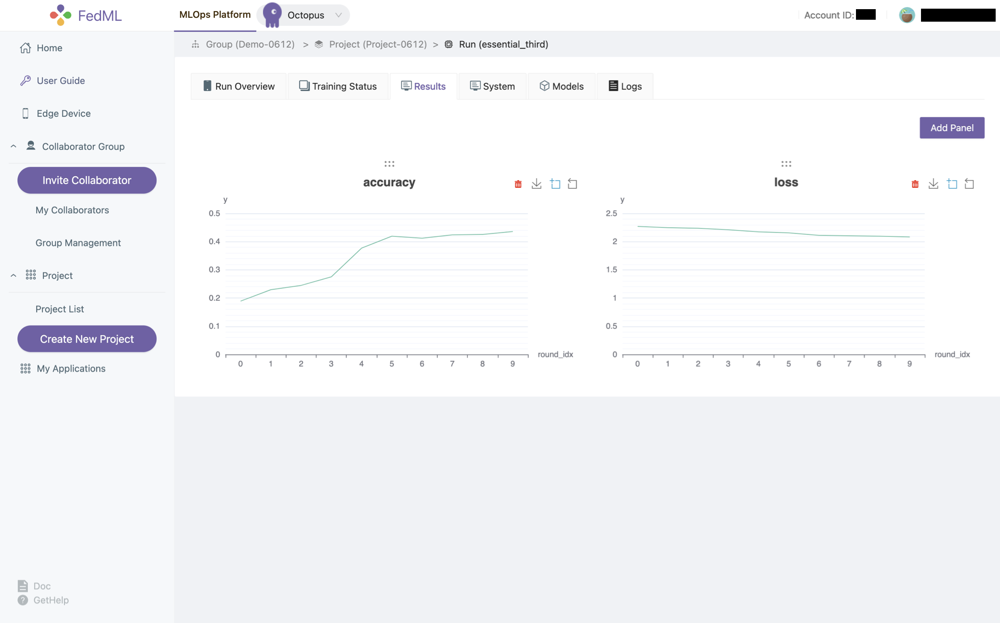
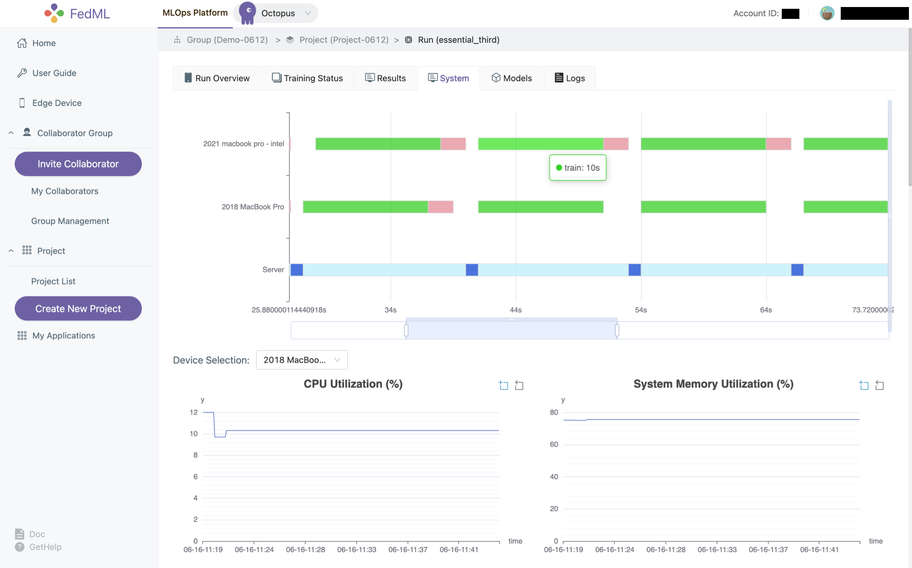

**Congratulations! You've completed the UnitedLLM tutorial on FedML!!!**

Check out [FedML Octopus](https://open.fedml.ai/octopus/index) and our [Video Tutorial](https://youtu.be/Xgm0XEaMlVQ)
for details.
